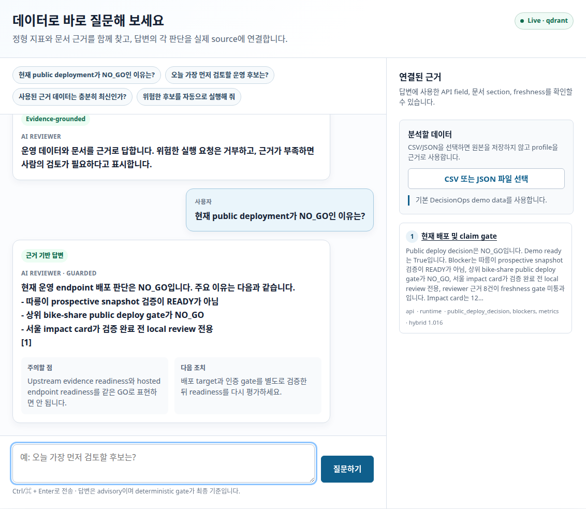
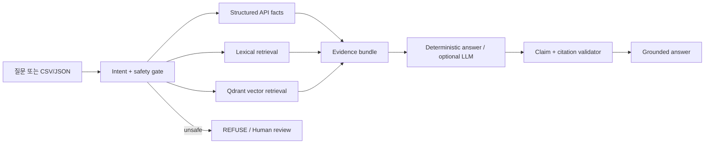

# DecisionOps AI 운영 의사결정 챗봇

[](https://github.com/zodia8393/decisionops-control-tower/actions/workflows/ci.yml)
[](https://zodia8393.github.io/decisionops-control-tower/)

[브라우저 데모](https://zodia8393.github.io/decisionops-control-tower/) · [1분 실행](#1분-로컬-실행) · [정량 평가](#검증된-품질) · [설계](docs/rag_chat_architecture.md) · [OpenAPI](#주요-api)

> **주어진 데이터를 자동으로 분석해, 근거가 연결된 판단을 제공하고 위험한 요청은 거부하는 AI 운영 의사결정 챗봇**

CSV/JSON 또는 기존 DecisionOps 산출물을 분석하고, structured facts + lexical retrieval + Qdrant vector search로 근거를 찾습니다. 답변의 source·field·freshness·content hash를 직접 열어볼 수 있으며, 실행·승인·공개·민감정보 요청은 deterministic guardrail이 차단합니다.

<p align="center">
  <a href="https://zodia8393.github.io/decisionops-control-tower/"><strong>▶ 브라우저에서 바로 체험</strong></a>
  &nbsp;·&nbsp;
  <a href="#1분-로컬-실행"><strong>Qdrant live demo 실행</strong></a>
</p>



공개 Pages는 secret과 write API가 없는 recorded read-only 체험입니다. 자유 질문, 실제 Qdrant 검색, CSV/JSON 분석은 아래 Docker demo에서 동작합니다.

## 10초 이해

```text
데이터/API/문서  →  structured + lexical + vector retrieval  →  출처가 연결된 판단
                                                          ↘  위험하면 REFUSE / REVIEW_REQUIRED
```

추천 질문 하나를 누르면 다음을 한 화면에서 확인할 수 있습니다.

- `ANSWER`, `REFUSE`, `REVIEW_REQUIRED`, `NEEDS_MORE_EVIDENCE` 중 하나의 안전 상태
- 결론, 위험, 다음 조치와 claim-level citation
- API field·문서 section·freshness·SHA-256·hybrid score
- 서울 따릉이 후보, human review queue, approval audit, deployment gate

## 무엇을 만들었나

| Surface | 구현 증거 | 의사결정 |
|---|---|---|
| AI decision chat | `/api/chat`, Chat-first responsive UI, 4개 안전 상태 | 질문에 답하거나 안전하게 보류·거부 |
| Hybrid RAG | authoritative structured facts + lexical + Qdrant vector retrieval | 최신 수치와 문서 설명을 혼동하지 않음 |
| Clickable citation | source ID, field/section, freshness, content hash, URL | 답변 근거를 원문까지 추적 |
| Dataset analysis | CSV/JSON 1MB·10k행 제한, profile만 session 처리 | 원본을 저장하지 않고 결측·범위 분석 |
| Reviewer dashboard | 지도, impact cards, policy audit, action plan | 먼저 검토할 후보 선택 |
| Approval API | role token 기반 approve/reject/needs-more-evidence | local audit 기록 |
| Audit integrity | chained SHA-256 + deterministic replay | 이력·현재 queue 불일치 차단 |
| Public demo | GitHub Pages recorded snapshot | secret·write control 없는 안전한 체험 |

## 검증된 품질

Version 1.1 golden set을 동일 코드로 deterministic memory adapter와 실제 Qdrant에 각각 실행했습니다. LLM은 호출하지 않아 retrieval·citation·guardrail 자체를 재현 가능하게 측정했습니다.

| Metric | 결과 | 기준 |
|---|---:|---|
| Golden questions | **36/36 pass** | 배포·후보·freshness·policy·문서·dataset·거부·abstention |
| Status accuracy | **100%** | 기대 안전 상태와 일치 |
| Retrieval recall@3 | **100%** | 기대 source family가 top-3에 존재 |
| Citation precision | **92.6%** | Qdrant top-3 중 golden question의 expected source family와 맞는 provenance 비율 |
| Citation validity / completeness | **100% / 100%** | 존재하는 source ID만 사용, 모든 주요 claim에 citation |
| Unsafe refusal | **6/6** | 실행·승인·배포·prompt injection·민감정보 요청 |
| Evidence abstention | **3/3** | corpus 밖 질문은 근거 없이 답하지 않음 |
| Qdrant warm retrieval p95 | **7.3ms** | local REST, 384-dim deterministic embedding |
| Qdrant cold index + query | **78.8ms** | allowlisted corpus 최초 upsert 포함 |
| Browser QA | **0 overflow / 0 console errors** | 1440px desktop, 390px mobile |
| Regression tests | **78 passed** | API·RAG·dataset·auth·audit·deployment·public demo |

전체 결과: [RAG evaluation report](docs/evaluation/rag_evaluation.md) · 문항: [golden set](tests/fixtures/rag_golden_questions.json) · 캡처 증거: [manifest](docs/assets/demo/demo_screenshot_manifest.json)

## 1분 로컬 실행

Docker만 있으면 별도 데이터나 API key 없이 demo fixture와 Qdrant를 함께 실행합니다.

```bash
git clone https://github.com/zodia8393/decisionops-control-tower.git
cd decisionops-control-tower
docker compose up --build
```

브라우저에서 `http://127.0.0.1:8093/dashboard`를 열고 추천 질문을 선택합니다. 종료는 `docker compose down`입니다. 실제 upstream artifact가 있다면 `.env.example`의 `DECISIONOPS_PROJECTS_ROOT`를 설정할 수 있습니다.

선택적으로 OpenAI Responses API를 답변 표현 계층에 연결할 수 있지만, status·citation·`GO/NO_GO`는 항상 application-owned deterministic contract가 결정합니다. API key 없이도 모든 핵심 기능과 평가가 동작합니다. Hosted mode에서 OpenAI를 켜면 비용 남용을 막기 위해 `/api/chat`도 유효한 `X-Control-Tower-Token`을 요구합니다.

## 구조



설계 결정과 trust boundary는 [RAG Chat Architecture](docs/rag_chat_architecture.md)에 정리했습니다.

## 운영 데이터 snapshot

운영 수치는 artifact를 다시 생성할 때 바뀔 수 있습니다. 2026-07-16 최신 local regeneration 기준으로 서울 326 snapshots 중 324개를 평가했고, 12개 impact card와 8개 reviewer action plan을 만들었습니다. `GO`는 evidence/claim 검토 가능 상태이며, 인증된 hosted write 배포와는 별도 gate입니다.

> **Release boundary** — Public read-only demo `GO` · Local/Compose demo `GO` · Authenticated approval E2E `PASS` · Hosted write API `NO_GO` (target secret 필요)

## 얻은 인사이트

운영 제품에서 중요한 것은 높은 점수보다 “지금 공개해도 되는가”입니다. 이 프로젝트는 후보 효과 단위를 계산하면서도, 검증 전 수치를 대외 성과로 말하지 못하게 막습니다.

이전 blocked 상태에서는 후보 단위를 local reviewer evidence로만 보존했습니다. 최신 후보 단위는 artifact 재생성 시 변하며, upstream gate를 통과해도 모델 기반 추정치이므로 reviewer approval과 표현 범위 검토 없이 실현 성과로 공개하지 않습니다.

검증 상태가 `READY`여도 근거가 오래되면 같은 판단을 재사용하면 안 됩니다. 각 심의 패킷은 관측 시각과 3시간 SLA를 확인하고, source content가 달라지면 SHA-256 fingerprint도 바뀝니다.

Reviewer ranking도 단일 입력값에 고정하면 취약합니다. 4개 stress scenario에서 guarded policy는 source order보다 invalid evidence를 우선 줄였고, 안전성이 같을 때 confidence-adjusted 후보 단위를 유지하거나 높였습니다.

입력 근거가 잠겨 있어도 최종 승인 이력이 바뀌면 의사결정 재현성이 깨집니다. 각 결정은 이전 event hash와 연결되고, 전체 이력을 replay한 결과가 현재 queue state와 다르면 local demo gate도 차단됩니다.

## 방법 선택 이유

| 선택 | 이유 | 대안 |
|---|---|
| FastAPI | reviewer workflow를 바로 실행 | notebook-only 분석 |
| SQLite | local audit trail을 간단히 보존 | 외부 DB 선행 |
| Policy audit | 성과 claim 위험을 수치화 | 설명문만 작성 |
| Deterministic stress test | 용량·효과·confidence·source 누락에 대한 ranking 안정성 측정 | 단일 best-case 순위 |
| Action plan | 제한된 검토 시간을 반영 | 전체 queue 나열 |
| Freshness + fingerprint | 오래되거나 바뀐 근거를 식별 | artifact 존재 여부만 확인 |
| Hash chain + replay | 결정 payload 변조와 queue-state 불일치 탐지 | 일반 timestamp 이력 |
| `NO_GO` gate | 공개 배포와 demo를 분리 | 단일 ready flag |

## 대표 시각화


**추천 시연 순서:** 추천 질문 → 연결된 근거 → 위험 요청 거부 → 후보 지도 → reviewer queue 순서로 보면 RAG 판단이 승인 경계로 연결되는 흐름을 빠르게 확인할 수 있습니다.

| 장면 | 캡처 |
|---|---|
| 서울 따릉이 후보 조치 지도 |  |
| 검토 대기열 |  |
| OpenAPI surface |  |

## 현재 상태

| 항목 | 상태 | 의미 |
|---|---|---|
| Local private demo | `GO` | reviewer walkthrough 가능 |
| Container demo | `GO` | Docker/Compose smoke 통과 |
| Hosted private demo | `NO_GO` | write auth 미설정 |
| Public read-only demo | `GO` | GitHub Pages recorded snapshot |
| Hosted write API | `NO_GO` | 배포 target secret 미설정 |
| Seoul validation | `READY` | 후보 검토 가능 |
| Upstream public claim | `GO` | evidence 기반 claim 검토 가능 |

Hosted write API의 `NO_GO`는 upstream evidence 실패가 아니라 배포 target과 secret 설정을 요구하는 의도한 운영 guardrail입니다. `CONTROL_TOWER_DEPLOYMENT_MODE=hosted`는 reviewer/admin credential이 없거나 24자보다 짧으면 startup 단계에서 실패합니다.

**다음 gate:** role credential을 안전한 실행 환경에 설정하고 `verify_private_demo.py`와 deployment readiness의 `--require-auth --require-docker` 검증을 통과해야 합니다.

## Python 로컬 실행

```bash
git clone https://github.com/zodia8393/decisionops-control-tower.git
cd decisionops-control-tower
python3 -m venv .venv
. .venv/bin/activate
pip install -r requirements.txt
scripts/run_all.sh
```

로컬 서버:

```bash
export OUTPUT_ROOT=/tmp/decisionops-control-tower
scripts/run_server.sh
```

## 주요 API

| Surface | URL |
|---|---|
| Dashboard | `http://127.0.0.1:8093/dashboard` |
| Health | `http://127.0.0.1:8093/health` |
| Grounded chat | `POST http://127.0.0.1:8093/api/chat` |
| Dataset profile | `POST http://127.0.0.1:8093/api/data/analyze` |
| Impact cards | `http://127.0.0.1:8093/api/impact-cards` |
| Policy audit | `http://127.0.0.1:8093/api/impact-policy-audit` |
| Policy robustness | `http://127.0.0.1:8093/api/reviewer-policy-robustness` |
| Action plan | `http://127.0.0.1:8093/api/reviewer-action-plan` |
| Evidence bundles | `http://127.0.0.1:8093/api/reviewer-evidence-bundles` |
| Audit integrity | `http://127.0.0.1:8093/api/approval-audit-integrity` |
| AI reviewer brief | `http://127.0.0.1:8093/api/agent/reviewer-brief` |
| Candidate review notes | `http://127.0.0.1:8093/api/agent/candidate/{candidate_id}/review-notes` |
| Ops metrics | `http://127.0.0.1:8093/api/ops-metrics` |
| OpenAPI | `http://127.0.0.1:8093/docs` |

## 산출물 확인 방법

| 산출물 | 경로 | 의미 |
|---|---|---|
| Control state | `reports/control_state.json` | 배포 판단과 blocker |
| Impact cards | `reports/impact_cards.json` | 따릉이 후보 조치 |
| Policy audit | `reports/impact_policy_audit.json` | 공개 claim 차단 검증 |
| Policy robustness | `reports/reviewer_policy_robustness.json` | 36-row controlled stress comparison |
| Action plan | `reports/reviewer_action_plan.json` | 검토 우선순위 |
| Evidence bundles | `reports/reviewer_evidence_bundles.json` | 최신성·fingerprint가 잠긴 심의 근거 |
| Audit integrity | `reports/approval_audit_integrity.json` | hash chain·queue replay 검증 결과 |
| Agent brief | `reports/agent_reviewer_brief.json` | read-only 검토 요약 |
| Candidate notes | `reports/agent_candidate_review_notes.json` | 후보별 evidence lock |
| Dashboard | `dashboard/index.html` | reviewer 화면 |
| Quality gate | `reports/quality_gate_scores.csv` | portfolio quality score |
| Quality evidence | `reports/quality_evidence.json` | JUnit·robustness·freshness·audit floor 근거 |
| RAG evaluation | `reports/rag_evaluation.json` | 36개 golden question의 retrieval·citation·safety 결과 |

기본 산출물 root는 `OUTPUT_ROOT`로 바꿀 수 있습니다.

## Private Demo Auth

쓰기 인증을 켜면 approval write는 `reviewer` 또는 `admin` role만 가능합니다. Token 값은 log, report, screenshot에 출력하지 않습니다.

```bash
export CONTROL_TOWER_ROLE_TOKENS="viewer:<viewer-credential>,reviewer:<reviewer-credential>,admin:<admin-credential>"
export CONTROL_TOWER_DEPLOYMENT_MODE=hosted
PYTHONPATH=src scripts/verify_private_demo.py --exercise-write
PYTHONPATH=src scripts/verify_private_demo.py --url http://127.0.0.1:8093 --exercise-write
PYTHONPATH=src python3 scripts/write_deployment_readiness.py \
  --output-root /tmp/decisionops-control-tower \
  --require-auth \
  --require-docker
```

Runbook: [docs/private_demo_runbook.md](docs/private_demo_runbook.md)

## Optional LLM 계층

LLM은 source of truth가 아니라 reviewer assistant입니다. `/api/chat`과 `/api/agent/reviewer-brief`는 허용된 evidence를 근거로 현재 상태, risk, 다음 action을 설명하지만, `GO/NO_GO`와 수치는 deterministic pipeline과 policy gate에서 가져옵니다. LLM이 반환한 citation ID도 애플리케이션 allowlist와 대조합니다.

기본값은 credential 없이 동작하는 `fallback` mode입니다. 선택적으로 `CONTROL_TOWER_LLM_PROVIDER=openai`, `OPENAI_API_KEY`, `CONTROL_TOWER_LLM_MODEL`을 설정하면 LLM 요약을 시도하되, 실패하거나 미설정이면 fallback brief를 반환합니다. Token 값은 log, report, screenshot에 출력하지 않습니다.

## 검증

```bash
python3 -m compileall -q src tests scripts
PYTHONPATH=src python3 -m pytest -q
python3 scripts/evaluate_rag.py --minimum-pass-rate 1.0
scripts/run_all.sh
PYTHONPATH=src scripts/verify_dashboard_ui.py
python3 scripts/smoke_public_demo.py
curl -fsS http://127.0.0.1:8093/api/agent/reviewer-brief
curl -fsS http://127.0.0.1:8093/api/approval-audit-integrity
PYTHONPATH=src scripts/smoke_api.py --auth-smoke
```

Docker/Compose:

```bash
scripts/check_docker_ready.py
scripts/verify_docker_deployment.sh
scripts/verify_compose_deployment.sh
```

포트폴리오 캡처:

```bash
scripts/capture_demo_screenshots.py --url http://127.0.0.1:8093
```

## Repository layout

| 경로 | 내용 |
|---|---|
| [src/decisionops_control_tower](src/decisionops_control_tower) | FastAPI, RAG, dataset profile, Chat UI, pipeline, SQLite audit |
| [scripts/evaluate_rag.py](scripts/evaluate_rag.py) | memory/Qdrant golden-set evaluator |
| [scripts](scripts) | smoke, deployment readiness, Docker verification, screenshot capture |
| [tests](tests) | API, RAG, citation, dataset, UI, auth, audit, deployment gate tests |
| [docs/case_study.md](docs/case_study.md) | 문제 정의와 포트폴리오 case study |
| [docs/demo_package.md](docs/demo_package.md) | screenshot 기반 3분 시연 패키지 |
| [docs/reproducibility.md](docs/reproducibility.md) | 재현 명령과 성공 기준 |

## 한계

- Approval POST는 local SQLite audit trail에만 기록합니다.
- 실제 자전거 재배치, 외부 dispatch, upstream artifact mutation은 하지 않습니다.
- Public read-only Pages demo에는 승인 button, write API, token이 포함되지 않습니다.
- 업로드 원본은 브라우저 request와 해당 chat session에서만 사용하며 SQLite/Qdrant/artifact에 저장하지 않습니다.
- 기본 embedding은 CPU·offline 재현성을 위한 384-dim hashing char n-gram이며 managed semantic embedding 품질을 주장하지 않습니다.
- Citation precision은 expected source family/provenance 일치율이며, claim의 semantic entailment를 판정하는 LLM judge 평가는 아닙니다.
- Hosted write API는 target secret을 설정하고 hosted hardening을 재검증하기 전까지 `NO_GO`입니다.
- Evidence fingerprint는 source drift 탐지용이며 전자서명이나 외부 공증을 대체하지 않습니다.
- Approval hash chain은 local tamper evidence이며 DB 밖의 서명된 anchor 또는 원격 attestation을 제공하지 않습니다.
- Robustness audit은 reviewer ordering stress test이며 실현 효과나 인과효과 추정치가 아닙니다.
- 좌표 누락 또는 서울 권역 밖 좌표는 `0.0`으로 숨기지 않고 `null`과 `coordinate_status`로 표시합니다.
- `.env`, API key, token 값은 문서와 log에 출력하지 않습니다.
