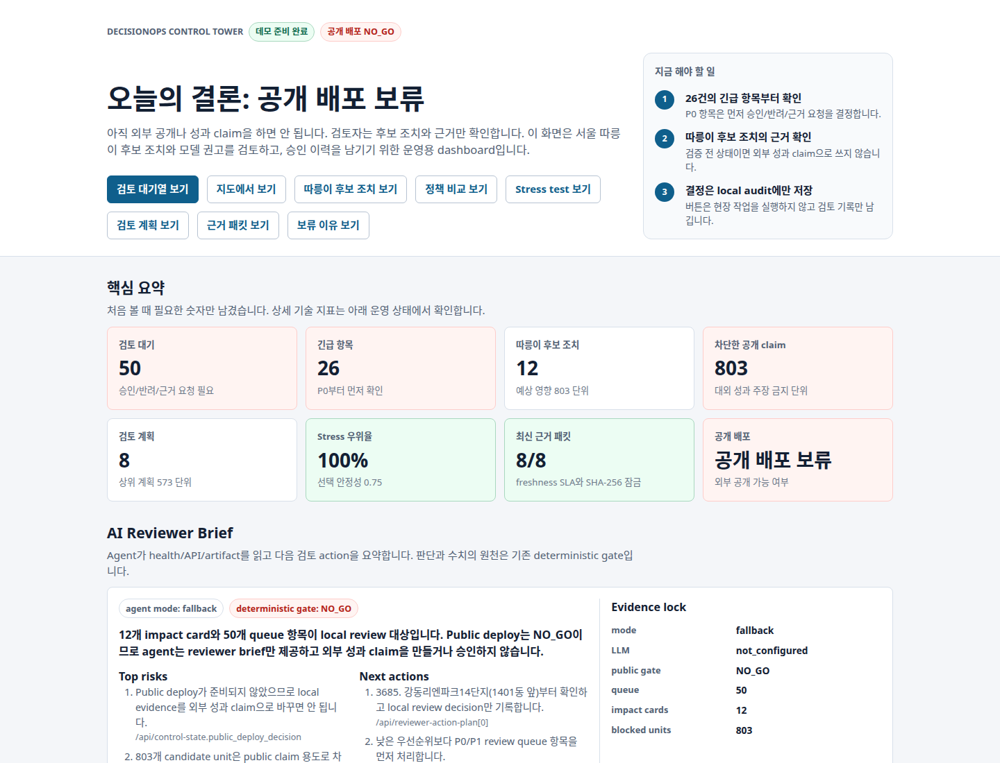
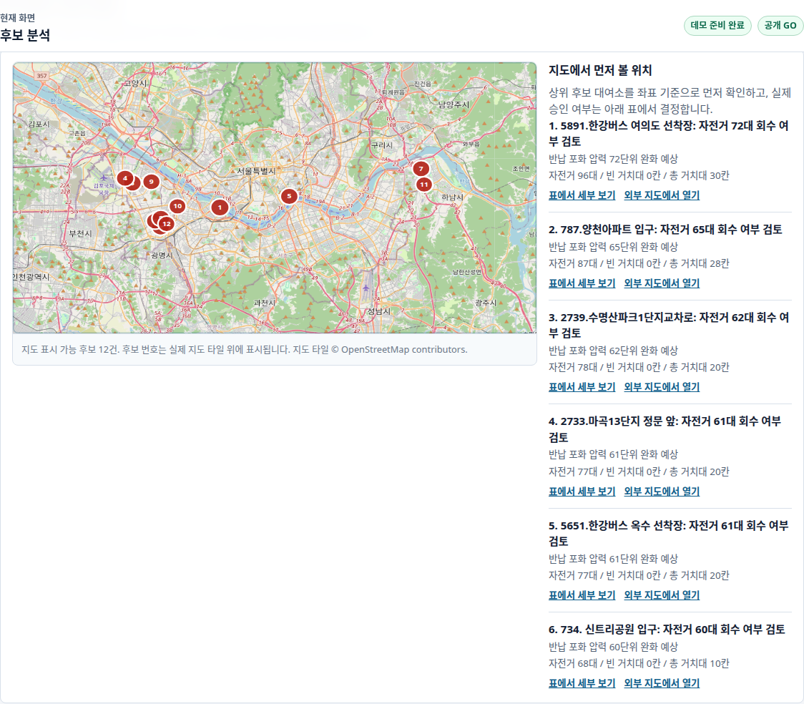
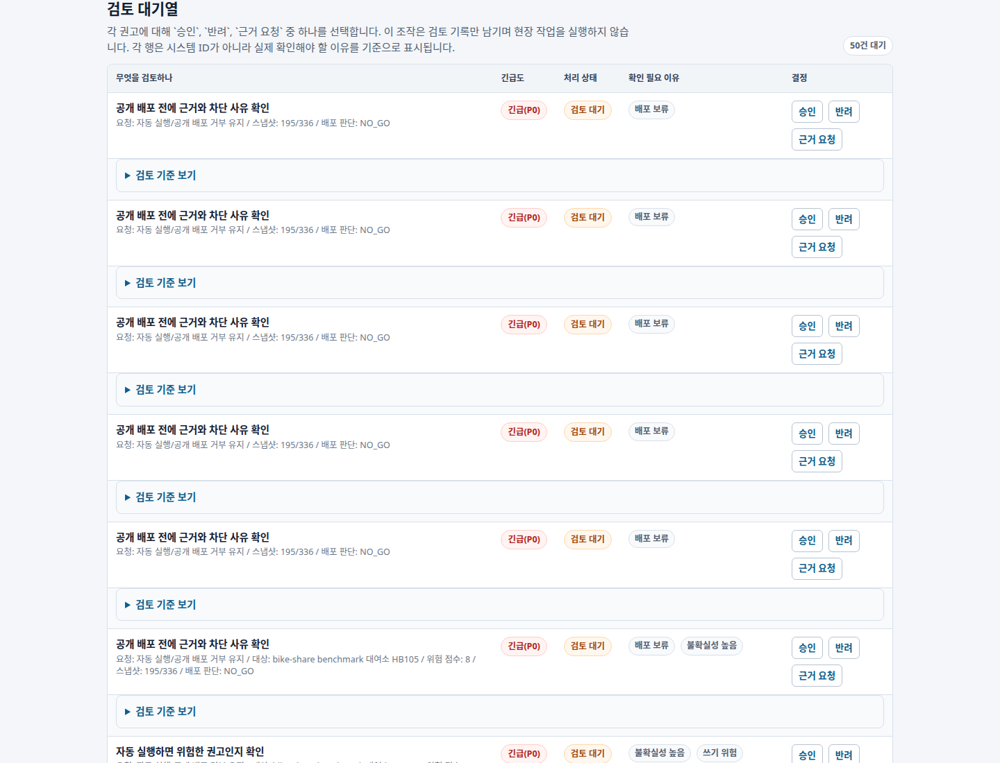
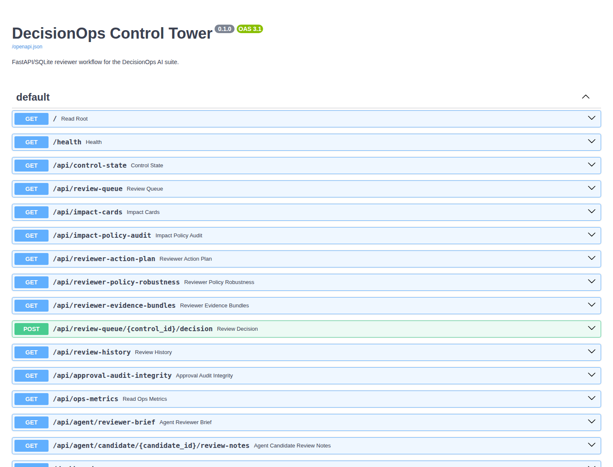

# DecisionOps Control Tower

[](https://github.com/zodia8393/decisionops-control-tower/actions/workflows/ci.yml)

[핵심 수치](#핵심-수치) · [대표 시각화](#대표-시각화) · [현재 상태](#현재-상태) · [Quick Start](#실행-방법) · [Private Auth](#private-demo-auth)

## 결론

서울 공공자전거 운영 문제를 예측 점수에서 끝내지 않고, 지도 기반 후보 조치, 사람 검토 대기열, 승인 기록, 배포 가능 여부 판단까지 연결한 AI/ML product slice입니다.

현재 upstream evidence와 public-claim gate는 `GO`입니다. Local/container demo도 `GO`지만, hosted/public endpoint 배포는 write auth credential이 없어 `NO_GO`입니다.

> **Release snapshot · 2026-07-16** — Evidence/claim `GO` · Local/container `GO` · Audit integrity `PASS` · Hosted/public `NO_GO` (write auth 필요)

## 무엇을 만들었나

| Surface | 구현 증거 | 의사결정 |
|---|---|---|
| Reviewer dashboard | 지도, impact cards, policy audit, action plan | 먼저 검토할 후보 선택 |
| Policy robustness | 4 stress scenarios × 3 capacities × 3 policies | 안전 우선 ranking 안정성 확인 |
| AI Reviewer Agent | evidence-locked reviewer brief, candidate review notes | 근거 기반 검토 요약 |
| Evidence bundles | source age, 3-hour SLA, SHA-256 fingerprint | stale 근거 차단·content drift 식별 |
| Approval API | role token 기반 approve/reject/needs-more-evidence | local audit 기록 |
| SQLite audit trail | `control_tower.sqlite` | 결정 이력 보존 |
| Audit integrity | chained SHA-256 + deterministic replay | 이력·현재 queue 불일치 차단 |
| Deployment gate | local/container/hosted/public 분리 | 공개 여부 `GO/NO_GO` |

## 핵심 수치

| 항목 | 값 | 의미 |
|---|---:|---|
| Impact cards | 12 | 서울 따릉이 후보 조치 수 |
| Candidate units | 1,007 | 검토 대상 후보 이동량 |
| Claim-eligible modeled units | 1,007 | upstream validation과 claim gate를 통과한 추정 단위 |
| Reviewer action plan | 8 | 검토자가 먼저 볼 local-only 계획 |
| Agent review notes | 8 | 상위 후보별 evidence-locked 검토 메모 |
| Fresh evidence bundles | 8/8 | 최신성·content lock 계약을 통과한 심의 패킷 |
| Robustness comparisons | 36 | 효과 jitter·confidence stress·source dropout 포함 |
| Guarded safety dominance | 100% | invalid evidence를 먼저 줄이고 동률에서 조정 단위 비교 |
| Audit integrity | `PASS` | reviewer history chain과 queue-state replay 통과 |
| Docker/Compose smoke | `PASS` | 격리 build·HTTP·healthcheck 실행 후 transient 자원 정리 확인 |
| Seoul validation | 319 snapshots / 317 evaluated | upstream inventory evidence `READY` |
| Review queue | 54 | 승인/반려/근거 요청 대기 건수 |
| Upstream public claim | `GO` | evidence 기반 claim 검토 가능 |
| Public endpoint deploy | `NO_GO` | write auth credential 설정 필요 |
| Evidence-backed quality | 96.0 | fresh JUnit·robustness·freshness·audit artifact가 모두 있을 때만 활성화 |
| Verified tests | 32 passed | quality fallback, API, audit, auth, deployment bind regression 포함 |

## 얻은 인사이트

운영 제품에서 중요한 것은 높은 점수보다 “지금 공개해도 되는가”입니다. 이 프로젝트는 후보 효과 단위를 계산하면서도, 검증 전 수치를 대외 성과로 말하지 못하게 막습니다.

이전 blocked 상태에서는 후보 단위를 local reviewer evidence로만 보존했습니다. 현재 1,007단위는 upstream gate를 통과했지만, 모델 기반 추정치이므로 reviewer approval과 표현 범위 검토 없이 실현 성과로 공개하지 않습니다.

검증 상태가 `READY`여도 근거가 오래되면 같은 판단을 재사용하면 안 됩니다. 각 심의 패킷은 관측 시각과 3시간 SLA를 확인하고, source content가 달라지면 SHA-256 fingerprint도 바뀝니다.

Reviewer ranking도 단일 입력값에 고정하면 취약합니다. 4개 stress scenario에서 guarded policy는 source order보다 invalid evidence를 우선 줄였고, 안전성이 같을 때 confidence-adjusted 후보 단위를 유지하거나 높였습니다.

입력 근거가 잠겨 있어도 최종 승인 이력이 바뀌면 의사결정 재현성이 깨집니다. 각 결정은 이전 event hash와 연결되고, 전체 이력을 replay한 결과가 현재 queue state와 다르면 local demo gate도 차단됩니다.

## 방법 선택 이유

| 선택 | 이유 | 대안 |
|---|---|
| FastAPI | reviewer workflow를 바로 실행 | notebook-only 분석 |
| SQLite | local audit trail을 간단히 보존 | 외부 DB 선행 |
| Policy audit | 성과 claim 위험을 수치화 | 설명문만 작성 |
| Deterministic stress test | 용량·효과·confidence·source 누락에 대한 ranking 안정성 측정 | 단일 best-case 순위 |
| Action plan | 제한된 검토 시간을 반영 | 전체 queue 나열 |
| Freshness + fingerprint | 오래되거나 바뀐 근거를 식별 | artifact 존재 여부만 확인 |
| Hash chain + replay | 결정 payload 변조와 queue-state 불일치 탐지 | 일반 timestamp 이력 |
| `NO_GO` gate | 공개 배포와 demo를 분리 | 단일 ready flag |

## 대표 시각화



**추천 시연 순서:** dashboard overview → 후보 지도 → reviewer queue → audit integrity → deployment gate 순서로 보면 분석 근거가 승인 경계로 연결되는 흐름을 빠르게 확인할 수 있습니다.

| 장면 | 캡처 |
|---|---|
| 서울 따릉이 후보 조치 지도 |  |
| 검토 대기열 |  |
| OpenAPI surface |  |

시연 흐름은 [docs/demo_package.md](docs/demo_package.md)에 정리했습니다.

## 현재 상태

| 항목 | 상태 | 의미 |
|---|---|---|
| Local private demo | `GO` | reviewer walkthrough 가능 |
| Container demo | `GO` | Docker/Compose smoke 통과 |
| Hosted private demo | `NO_GO` | write auth 미설정 |
| Public endpoint deploy | `NO_GO` | write auth 미설정 |
| Seoul validation | `READY` | 후보 검토 가능 |
| Upstream public claim | `GO` | evidence 기반 claim 검토 가능 |

endpoint의 `NO_GO`는 upstream evidence 실패가 아니라 인증 설정을 요구하는 의도한 운영 guardrail입니다.

**다음 gate:** role credential을 안전한 실행 환경에 설정하고 `verify_private_demo.py`와 deployment readiness의 `--require-auth --require-docker` 검증을 통과해야 합니다.

## 실행 방법

```bash
git clone https://github.com/zodia8393/decisionops-control-tower.git
cd decisionops-control-tower
python3 -m venv .venv
. .venv/bin/activate
pip install -r requirements.txt
scripts/run_all.sh
```

로컬 서버:

```bash
export OUTPUT_ROOT=/tmp/decisionops-control-tower
scripts/run_server.sh
```

주요 URL:

| Surface | URL |
|---|---|
| Dashboard | `http://127.0.0.1:8093/dashboard` |
| Health | `http://127.0.0.1:8093/health` |
| Impact cards | `http://127.0.0.1:8093/api/impact-cards` |
| Policy audit | `http://127.0.0.1:8093/api/impact-policy-audit` |
| Policy robustness | `http://127.0.0.1:8093/api/reviewer-policy-robustness` |
| Action plan | `http://127.0.0.1:8093/api/reviewer-action-plan` |
| Evidence bundles | `http://127.0.0.1:8093/api/reviewer-evidence-bundles` |
| Audit integrity | `http://127.0.0.1:8093/api/approval-audit-integrity` |
| AI reviewer brief | `http://127.0.0.1:8093/api/agent/reviewer-brief` |
| Candidate review notes | `http://127.0.0.1:8093/api/agent/candidate/{candidate_id}/review-notes` |
| Ops metrics | `http://127.0.0.1:8093/api/ops-metrics` |
| OpenAPI | `http://127.0.0.1:8093/docs` |

## 산출물 확인 방법

| 산출물 | 경로 | 의미 |
|---|---|---|
| Control state | `reports/control_state.json` | 배포 판단과 blocker |
| Impact cards | `reports/impact_cards.json` | 따릉이 후보 조치 |
| Policy audit | `reports/impact_policy_audit.json` | 공개 claim 차단 검증 |
| Policy robustness | `reports/reviewer_policy_robustness.json` | 36-row controlled stress comparison |
| Action plan | `reports/reviewer_action_plan.json` | 검토 우선순위 |
| Evidence bundles | `reports/reviewer_evidence_bundles.json` | 최신성·fingerprint가 잠긴 심의 근거 |
| Audit integrity | `reports/approval_audit_integrity.json` | hash chain·queue replay 검증 결과 |
| Agent brief | `reports/agent_reviewer_brief.json` | read-only 검토 요약 |
| Candidate notes | `reports/agent_candidate_review_notes.json` | 후보별 evidence lock |
| Dashboard | `dashboard/index.html` | reviewer 화면 |
| Quality gate | `reports/quality_gate_scores.csv` | portfolio quality score |
| Quality evidence | `reports/quality_evidence.json` | JUnit·robustness·freshness·audit floor 근거 |

기본 산출물 root는 `OUTPUT_ROOT`로 바꿀 수 있습니다.

## Private Demo Auth

쓰기 인증을 켜면 approval write는 `reviewer` 또는 `admin` role만 가능합니다. Token 값은 log, report, screenshot에 출력하지 않습니다.

```bash
export CONTROL_TOWER_ROLE_TOKENS="viewer:<viewer-credential>,reviewer:<reviewer-credential>,admin:<admin-credential>"
PYTHONPATH=src scripts/verify_private_demo.py
PYTHONPATH=src scripts/verify_private_demo.py --url http://127.0.0.1:8093
PYTHONPATH=src python3 scripts/write_deployment_readiness.py \
  --output-root /tmp/decisionops-control-tower \
  --require-auth \
  --require-docker
```

Runbook: [docs/private_demo_runbook.md](docs/private_demo_runbook.md)

## AI Reviewer Agent

LLM은 source of truth가 아니라 reviewer assistant입니다. `/api/agent/reviewer-brief`는 health/API/artifact를 근거로 현재 상태, claim risk, 다음 검토 action을 요약하지만, `GO/NO_GO`와 수치는 deterministic pipeline과 policy gate에서 가져옵니다.

기본값은 credential 없이 동작하는 `fallback` mode입니다. 선택적으로 `CONTROL_TOWER_LLM_PROVIDER=openai`, `OPENAI_API_KEY`, `CONTROL_TOWER_LLM_MODEL`을 설정하면 LLM 요약을 시도하되, 실패하거나 미설정이면 fallback brief를 반환합니다. Token 값은 log, report, screenshot에 출력하지 않습니다.

## 검증

```bash
python3 -m compileall -q src tests scripts
PYTHONPATH=src python3 -m pytest -q
scripts/run_all.sh
PYTHONPATH=src scripts/verify_dashboard_ui.py
curl -fsS http://127.0.0.1:8093/api/agent/reviewer-brief
curl -fsS http://127.0.0.1:8093/api/approval-audit-integrity
PYTHONPATH=src scripts/smoke_api.py --auth-smoke
```

Docker/Compose:

```bash
scripts/check_docker_ready.py
scripts/verify_docker_deployment.sh
scripts/verify_compose_deployment.sh
```

포트폴리오 캡처:

```bash
scripts/capture_demo_screenshots.py --url http://127.0.0.1:8093
```

## 구조

| 경로 | 내용 |
|---|---|
| [src/decisionops_control_tower](src/decisionops_control_tower) | pipeline, FastAPI app, dashboard renderer, SQLite store |
| [scripts](scripts) | smoke, deployment readiness, Docker verification, screenshot capture |
| [tests](tests) | API, pipeline, dashboard contract, private auth, deployment gate tests |
| [docs/case_study.md](docs/case_study.md) | 문제 정의와 포트폴리오 case study |
| [docs/demo_package.md](docs/demo_package.md) | screenshot 기반 3분 시연 패키지 |
| [docs/reproducibility.md](docs/reproducibility.md) | 재현 명령과 성공 기준 |

## 한계

- Approval POST는 local SQLite audit trail에만 기록합니다.
- 실제 자전거 재배치, 외부 dispatch, upstream artifact mutation은 하지 않습니다.
- Public endpoint deploy는 write auth credential을 설정하고 hosted hardening을 재검증하기 전까지 `NO_GO`입니다.
- Evidence fingerprint는 source drift 탐지용이며 전자서명이나 외부 공증을 대체하지 않습니다.
- Approval hash chain은 local tamper evidence이며 DB 밖의 서명된 anchor 또는 원격 attestation을 제공하지 않습니다.
- Robustness audit은 reviewer ordering stress test이며 실현 효과나 인과효과 추정치가 아닙니다.
- 좌표 누락 또는 서울 권역 밖 좌표는 `0.0`으로 숨기지 않고 `null`과 `coordinate_status`로 표시합니다.
- `.env`, API key, token 값은 문서와 log에 출력하지 않습니다.
