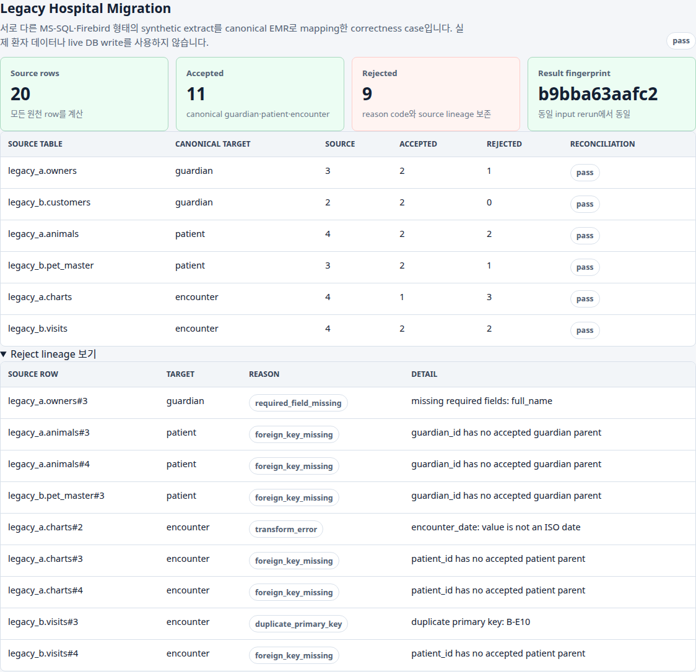
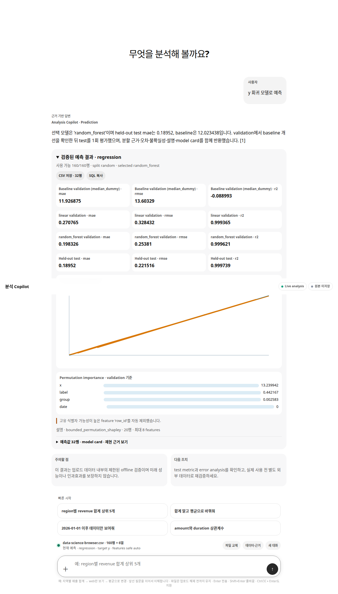
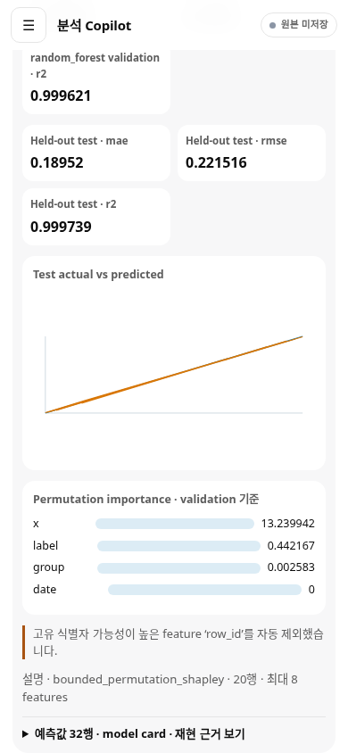

# Legacy Data Migration & Analysis Copilot

[](https://github.com/zodia8393/decisionops-control-tower/actions/workflows/ci.yml)
[](https://github.com/zodia8393/decisionops-control-tower/actions/workflows/migration-rdb.yml)
[](https://zodia8393.github.io/decisionops-control-tower/)

[RDB migration 실행](#실행-방법) · [브라우저 데모](https://zodia8393.github.io/decisionops-control-tower/) · [검증 결과](#핵심-수치) · [RDB 설계](docs/architecture_decision_rdb_migration.md) · [면접 가이드](docs/migration_interview_guide.md)

> **Firebird legacy data를 PostgreSQL canonical domain으로 안전하게 이관하고, 업로드한 표 데이터는 자연어로 검증·분석·예측하는 migration-first data product**

## 결론

실제 container network에서 **Firebird 5.0.4 → PostgreSQL 17.10** 이관을 실행합니다. 120,000개 synthetic legacy row를 2,500-row transaction 48개로 처리하고 `120,000 = 119,988 accepted + 12 rejected`를 전수 대사했습니다. 두 번째 batch 내부에서 의도적으로 failure를 발생시켜 target data와 checkpoint가 함께 rollback되는지 확인한 뒤, 새 DB connection이 2,500-row persisted checkpoint 다음부터 재개합니다. 완료 후 replay는 0건이며 PostgreSQL FK violation은 0건입니다. Firebird system catalog의 실제 column metadata가 mapping contract와 다르면 target domain write 전에 차단합니다.

이 사례는 **synthetic container integration**입니다. 실제 환자 정보, 병원 DB 접속, 운영 cutover, CDC, lock contention, backup/WAL recovery 또는 production SLA 경험을 주장하지 않습니다. 대신 source-target mapping, allowlisted transform, required/PK/FK validation, reject lineage, batch atomicity, checkpoint resume, idempotent replay, SHA-256 provenance를 실행 가능한 코드와 report로 보여줍니다.

같은 제품의 Analysis Copilot에는 CSV·JSON·XLSX·Parquet를 한 번 올린 뒤 자연어로 설명·품질 점검·집계·순위·관계·통계·예측을 이어서 요청할 수 있습니다. 보고서 제목 뒤 실제 header와 빈/공백/중복/`Unnamed` 컬럼명은 값과 열 순서를 유지한 채 정리하고, `합계` 같은 summary row는 원본에는 남기되 재집계 분모에서 기본 제외합니다. 질문은 arbitrary code가 아니라 typed `AnalysisPlan`으로 제한되며 숫자는 LLM이 아닌 DuckDB·SciPy·pandas·CPU sklearn이 계산합니다.

한 번 업로드한 파일은 `업로드 해제` 또는 정상적인 새 파일 교체 전까지 현재 browser chat에 계속 연결됩니다. `대화만 초기화`는 transcript와 누적 plan만 지우고 파일을 유지하며, `분석 조건만 초기화` 또는 “원본으로 돌아가”는 대화를 남긴 채 filter·group·metric·sort 상태만 원본 기준으로 되돌립니다. 현재 누적 조건은 화면에 항상 표시됩니다. 새 파일 검증이 실패해도 기존 정상 dataset과 분석 세션은 끊지 않습니다. 모든 수정은 원본을 덮어쓰는 mutation이 아니라 validated plan으로 만든 read-only working view입니다.

심화 질문은 별도 `AdvancedAnalysisPlan`으로 분포·IQR 이상치·그룹 차이 검정/효과크기/신뢰구간·Pearson/Spearman/선형관계·시계열 재집계/이동평균/증감을 실행합니다. 예측 질문은 `PredictionPlan`으로 회귀·분류·단변량 forecast를 실행하며, baseline과 validation에서 먼저 비교한 후보만 held-out test로 평가합니다. 표본 부족·상수 target·직접 누수·class imbalance는 차단하고 unique-ID feature는 제외합니다. 모델이 baseline을 1% 이상 개선하지 못하면 `NO_MODEL_GAIN`으로 끝내며, 승격된 결과에만 uncertainty·error analysis·learning curve·permutation importance·bounded permutation-Shapley·model card를 제공합니다.

기존 72개 schema·conversation 문항은 72/72를 유지합니다. Data Science golden set은 9개 dataset·22개 case에서 typed plan schema, 독립 pandas/SciPy/sklearn metric oracle, baseline/safety gate가 모두 22/22입니다. Migration은 20-row 사람이 읽을 수 있는 correctness fixture, 120k SQLite recovery rehearsal, 120k 실제 Firebird→PostgreSQL integration의 세 층으로 검증합니다. 사용자 평가는 현재 release 범위에서 제외했습니다.

<p align="center">
  <a href="https://zodia8393.github.io/decisionops-control-tower/"><strong>Recorded evidence-review demo</strong></a>
  &nbsp;·&nbsp;
  <a href="#실행-방법"><strong>Qdrant live demo 실행</strong></a>
</p>



현재 공개 Pages는 2026-07-20의 legacy evidence-review snapshot입니다. secret과 write API는 없지만 새 Analysis Copilot·migration 화면보다 이전 release이므로 `STALE`로 표시합니다. current source의 recorded snapshot build는 통과했으며 다음 승인된 Pages 배포에서 교체됩니다. 임의 파일 업로드, free-form 분석, 실제 Qdrant 검색은 배포 후에도 아래 local/Compose demo에서만 동작합니다.

## 무엇을 만들었나

| Surface | 구현 증거 | 의사결정 |
|---|---|---|
| Firebird→PostgreSQL migration | actual containers, 120k source rows, batch transaction, checkpoint/replay | networked RDB adapter와 rollback·resume를 별도 integration으로 격리 |
| Migration validation | actual catalog drift, required/PK/FK, reject lineage, reconciliation SHA-256 | 모든 source row를 accepted/rejected 중 정확히 하나로 귀속 |
| Decision Intelligence chat | sticky dataset session, 업로드 자동 overview, 실행형 추천, `/api/chat`, bounded multi-turn | 한 번 업로드한 원본에서 누적 조건 수정·조건 초기화·새 분석을 반복 |
| Deterministic analysis | `/api/data/query`, DuckDB, parameterized read-only SQL | 행수·분모·표·차트·SQL provenance 반환 |
| Advanced statistics | `/api/data/advanced`, `AdvancedAnalysisPlan`, SciPy+pandas | 분포·이상치·검정·효과크기·관계·시계열과 계산 가정 반환 |
| Predictive workflow | `/api/data/predict`, `PredictionPlan`, CPU sklearn | baseline→validation 선택→test 1회, uncertainty·error·explanation·model card |
| Hybrid RAG | authoritative structured facts + lexical + Qdrant vector retrieval | 최신 수치와 문서 설명을 혼동하지 않음 |
| Clickable citation | source ID, field/section, freshness, content hash, URL | 답변 근거를 원문까지 추적 |
| Dataset boundary | CSV/JSON/XLSX/Parquet, decoded 1MB·10k행·100열, report-style header 자동 감지·정리 | structure/rename mapping을 표시하고 원본은 SQLite·Qdrant·artifact에 저장하지 않음 |
| Legacy hospital fixture | 2개 source, versioned mapping, required/PK/FK, SQLite recovery rehearsal | 작은 correctness evidence와 실제 RDB integration 역할 분리 |
| Single Copilot shell | 분석 Copilot·Migration Lab·검증 결과·기술 상세 4개 영역 | 서로 다른 과거 도구가 아니라 하나의 데이터 검증 제품으로 시연 |
| Claim boundary | automated evidence와 운영 경력을 분리 | 사용자 평가는 현재 범위에서 생략하고 synthetic·production 한계를 명시 |
| Public demo | GitHub Pages recorded snapshot | secret·write control 없는 안전한 체험 |

기존 Control Tower의 review/approval API와 audit module은 backward compatibility 및 regression evidence로 남겨 두었지만, 기본 제품 화면에는 노출하지 않습니다. recruiter-facing UI의 목적은 업로드 분석과 migration 검증입니다.

## 핵심 수치

### Firebird → PostgreSQL container integration

| 항목 | 값 | 의미 |
|---|---:|---|
| Actual engines | **Firebird 5.0.4 → PostgreSQL 17.10** | 별도 container network의 실제 RDB read/write |
| Source reconciliation | **120,000 = 119,988 + 12** | accepted/rejected 누락 없는 전수 대사 |
| Batch execution | **2,500 rows × 48 transactions** | data와 checkpoint를 같은 transaction에 commit |
| Failure / recovery | **rollback PASS / resume at 2,500** | batch 중간 failure 뒤 새 connection에서 재개 |
| Replay / drift | **0 rows / pre-write block** | 완료 run no-op, 실제 Firebird metadata drift 차단 |
| Relational audit | **0 FK violations** | PostgreSQL 독립 SQL로 parent reference 재검산 |
| Provenance | **source·mapping·result SHA-256** | 입력·계약·결과 변화 추적 |
| Observed runtime | **30.931s · 3,879.6 rows/s** | 현재 machine 관측값이며 production SLA 아님 |

재현 결과: [integration report](docs/evaluation/firebird_postgres_migration.md) · [실행 설계](docs/architecture_decision_rdb_migration.md) · [runner](src/decisionops_control_tower/rdb_migration.py) · [CI workflow](.github/workflows/migration-rdb.yml)

### Analysis copilot

| 항목 | 값 | 의미 |
|---|---:|---|
| Schema/conversation tasks | **72/72 pass** | 5개 영문·한글 schema; template 40 + paraphrase 24 + multi-turn 8 |
| Paraphrase / multi-turn | **24/24 · 8/8** | humanized column, 자연어 비교, 상·하위, metric·group·filter 후속 수정 |
| AnalysisPlan validity | **100%** | Pydantic typed contract 재검증 |
| Numeric correctness | **100%** | DuckDB 결과를 독립 pandas oracle과 case-level 비교 |
| Browser flow | **PASS** | upload → auto description/statistics/recommendations → click→table/chart/SQL → multi-turn → reset |
| Browser errors | **0 overflow / 0 console errors** | 1440px desktop, 390px mobile |
| Regression | **204 passed** | parser·planner·executor·advanced/prediction·migration/recovery·RDB report·API·RAG·auth·audit·UI |

재현 결과: [analysis evaluation](docs/evaluation/analysis_evaluation.md) · [72-case challenge set](tests/fixtures/analysis_golden_tasks.json) · [구조](docs/analysis_copilot_architecture.md)

### Advanced analysis & prediction

| 항목 | 값 | 의미 |
|---|---:|---|
| Data Science golden cases | **22/22 pass** | 고급 통계 10개 + 회귀·분류·forecast·follow-up·실패 gate 12개 |
| Typed plan validity | **100%** | `AdvancedAnalysisPlan`·`PredictionPlan` closed contract 재검증 |
| Independent oracle | **100%** | pandas/SciPy 통계와 sklearn metric을 실행 결과에서 독립 재계산 |
| Safety/baseline gates | **100%** | small sample·constant target·leakage·imbalance·unique ID·no gain |
| Split discipline | **PASS** | IID 60/20/20, time chronological, forecast rolling-origin 3-fold, test 1회 |
| Explainability | **bounded** | raw-feature permutation importance + 최대 8 feature·20 row permutation-Shapley 근사 |
| Browser flow | **PASS** | desktop/mobile upload→advanced chart→follow-up→prediction model evidence |
| Browser errors | **0 overflow / 0 console / 0 page errors** | Chromium 1440×1100, 390×844 |
| Full regression | **204 passed** | Analysis·migration·RDB report·RAG·API/UI와 Data Science 계약 전체 |

재현 결과: [Data Science evaluation](docs/evaluation/data_science_evaluation.md) · [22-case golden set](tests/fixtures/data_science_golden_tasks.json) · [실행기](src/decisionops_control_tower/prediction_engine.py)

### Mapping correctness & SQLite recovery foundation

MS-SQL-style과 Firebird-style synthetic extract를 versioned mapping으로 canonical `guardian -> patient -> encounter` schema에 이관합니다. 일회성 성공 행만 보여주지 않고 required field, invalid date, duplicate PK, missing FK를 의도적으로 주입해 모든 source row의 최종 상태와 원인을 남깁니다.

| 항목 | 값 | 의미 |
|---|---:|---|
| Source systems / tables | **2 / 6** | 서로 다른 legacy naming·형식의 입력 |
| Source reconciliation | **20 = 11 + 9** | accepted/rejected 누락 없는 전수 대사 |
| Canonical target rows | **4 guardians / 4 patients / 3 encounters** | target 순서와 PK/FK 계약 검증 |
| Reject lineage | **9/9 traced** | required 1, transform 1, duplicate PK 1, missing FK 6 |
| Idempotency | **PASS** | source·mapping·result SHA-256와 동일 실행 fingerprint |
| SQLite scale rehearsal | **120,000 = 119,962 + 38** | generated rows를 2,500-row transaction 48개로 전수 대사 |
| Batch atomicity | **PASS** | mid-batch injected failure에서 target row·checkpoint 모두 rollback |
| Recovery | **PASS** | 7,500행 commit 후 의도적 중단 → persisted checkpoint부터 재개 |
| Replay / drift | **0 rows / blocked** | 완료 run 재실행 no-op·required column rename은 write 전 차단 |


재현 결과: [correctness report](docs/evaluation/migration_case_report.md) · [SQLite scale/recovery report](docs/evaluation/migration_rehearsal.md) · [설계 결정](docs/architecture_decision_legacy_hospital_migration.md) · [fixture](src/decisionops_control_tower/fixtures/legacy_hospital_migration.json)

두 foundation case와 위 Firebird→PostgreSQL integration은 모두 실제 환자 정보가 없는 synthetic evidence입니다. 실제 RDB adapter와 transaction은 integration에서 실행하지만, 운영 병원 cutover나 production 처리량·SLA를 구현하거나 주장하지 않습니다.

### Evidence RAG / safety

Version 1.1 golden set을 동일 코드로 deterministic memory adapter와 실제 Qdrant에 각각 실행했습니다. LLM은 호출하지 않아 retrieval·citation·guardrail 자체를 재현 가능하게 측정했습니다.

| 항목 | 값 | 의미 |
|---|---:|---|
| Golden questions | **36/36 pass** | 배포·후보·freshness·policy·문서·dataset·거부·abstention |
| Status accuracy | **100%** | 기대 안전 상태와 일치 |
| Retrieval recall@3 | **100%** | 기대 source family가 top-3에 존재 |
| Citation precision | **92.6%** | Qdrant top-3 중 golden question의 expected source family와 맞는 provenance 비율 |
| Citation validity / completeness | **100% / 100%** | 존재하는 source ID만 사용, 모든 주요 claim에 citation |
| Unsafe refusal | **6/6** | 실행·승인·배포·prompt injection·민감정보 요청 |
| Evidence abstention | **3/3** | corpus 밖 질문은 근거 없이 답하지 않음 |
| Qdrant warm retrieval p95 | **7.3ms** | local REST, 384-dim deterministic embedding |
| Qdrant cold index + query | **78.8ms** | allowlisted corpus 최초 upsert 포함 |
| Browser QA | **0 overflow / 0 console errors** | 1440px desktop, 390px mobile |
| RAG regression baseline | **36/36 pass** | 분석 숫자가 아닌 문서·운영 근거 retrieval 계층 |

전체 결과: [RAG evaluation report](docs/evaluation/rag_evaluation.md) · 문항: [golden set](tests/fixtures/rag_golden_questions.json) · 캡처 증거: [manifest](docs/assets/demo/demo_screenshot_manifest.json)

## 실행 방법

실제 Firebird→PostgreSQL migration evidence는 Docker만 있으면 한 명령으로 재현됩니다. script는 격리된 tmpfs database를 띄우고 120k integration report를 `build/migration-rdb/`에 만든 뒤 stack을 정리합니다.

```bash
git clone https://github.com/zodia8393/decisionops-control-tower.git
cd decisionops-control-tower
scripts/verify_rdb_migration.sh
```

분석 Copilot demo도 별도 데이터나 API key 없이 실행됩니다.

```bash
docker compose up --build
```

브라우저에서 `http://127.0.0.1:8093/dashboard`를 열고 CSV·JSON·XLSX·Parquet 파일을 한 번 선택합니다. 자동으로 표시되는 설명·품질·기초통계를 확인한 뒤 추천 버튼을 누르거나 원하는 분석을 직접 입력합니다. 이후 “web만 보기”, “orders 평균으로 바꿔줘”, “region 필터 제거”, “원본으로 돌아가”처럼 같은 파일에서 조건을 계속 수정할 수 있습니다. 종료는 `docker compose down`입니다. 실제 upstream artifact가 있다면 `.env.example`의 `DECISIONOPS_PROJECTS_ROOT`를 설정할 수 있습니다.

심화 분석과 예측은 같은 입력창에서 실행합니다.

```text
revenue 히스토그램으로 분포 분석
revenue IQR 이상치 찾아줘
region별 revenue 차이 검정
revenue와 cost Spearman 관계
date 기준 revenue 이동평균 7
y 회귀 모델로 예측
label 분류 모델
date 기준 value 향후 14일 예측
```

예측은 데이터가 안전 gate를 통과한 경우에만 실행됩니다. v1 forecast는 외생변수를 받지 않는 단변량 1~30기간 예측이며, 파일·모델은 서버에 저장하지 않습니다. 이 결과는 업로드 데이터 내부의 offline 검증이지 production 성능이나 인과효과 주장이 아닙니다.

선택적으로 OpenAI Responses API를 답변 표현 계층에 연결할 수 있지만, status·citation·`GO/NO_GO`는 항상 application-owned deterministic contract가 결정합니다. API key 없이도 모든 핵심 기능과 평가가 동작합니다. Hosted mode에서 OpenAI를 켜면 비용 남용을 막기 위해 `/api/chat`도 유효한 `X-Control-Tower-Token`을 요구합니다.

## 운영 데이터 snapshot

2026-07-22 09:03 KST Pages-equivalent 재생성 결과의 source 관측 시각은 **2026-07-22 08:25 KST**입니다. 서울 snapshot 462개, impact card 12건(model-validated estimate 742단위), reviewer action plan 8건(529단위), evidence freshness **8/8**로 해당 실행의 data/claim gate는 `GO`입니다. 이 판단은 3시간 freshness SLA에 따라 다시 만료될 수 있으며, 현장 dispatch/outcome이 없어 realized field impact는 계속 `미관측`입니다.

정적 read-only UI를 안전하게 생성할 수 있다는 사실, 실행 시점 data/claim gate, 실제 Pages 배포 여부는 서로 다른 상태입니다. Fresh source artifact는 UI build/smoke와 data gate를 통과했지만, 외부 Pages는 여전히 2026-07-20 legacy 화면이라 `STALE`입니다. Hosted write API도 credential 미설정으로 별도 `NO_GO`입니다.

로컬의 최신 검증 aggregate를 path·secret 없이 [public fixture](tests/fixtures/public_demo_inputs.json)로 갱신하려면 다음 명령을 실행합니다. source가 `NO_GO`이거나 3시간 freshness SLA를 넘으면 script가 갱신을 거부합니다.

```bash
PYTHONPATH=src python3 scripts/refresh_public_demo_inputs.py
```

> **Release boundary** — Current source local/Compose `GO` · 2026-07-22 09:03 KST recorded artifact `BUILD PASS / DATA GO` · deployed Pages `STALE legacy snapshot` · Hosted write API `NO_GO`

## 얻은 인사이트

운영 제품에서 중요한 것은 높은 점수보다 “지금 공개해도 되는가”입니다. 이 프로젝트는 후보 효과 단위를 계산하면서도, 검증 전 수치를 대외 성과로 말하지 못하게 막습니다.

이전 blocked 상태에서는 후보 단위를 local reviewer evidence로만 보존했습니다. 최신 후보 단위는 artifact 재생성 시 변하며, upstream gate를 통과해도 모델 기반 추정치이므로 reviewer approval과 표현 범위 검토 없이 실현 성과로 공개하지 않습니다.

Public `GO`는 model-validated estimate를 근거와 한계와 함께 설명할 수 있다는 뜻입니다. `unsafe_realized_impact_claim` 기준선은 같은 추정치를 현장 성과로 바꾸기 때문에 실패하고, guarded policy는 dispatch와 counterfactual outcome이 생길 때까지 그 단위를 차단합니다.

검증 상태가 `READY`여도 근거가 오래되면 같은 판단을 재사용하면 안 됩니다. 각 심의 패킷은 관측 시각과 3시간 SLA를 확인하고, source content가 달라지면 SHA-256 fingerprint도 바뀝니다.

Reviewer ranking도 단일 입력값에 고정하면 취약합니다. 4개 stress scenario에서 guarded policy는 source order보다 invalid evidence를 우선 줄였고, 안전성이 같을 때 confidence-adjusted 후보 단위를 유지하거나 높였습니다.

입력 근거가 잠겨 있어도 최종 승인 이력이 바뀌면 의사결정 재현성이 깨집니다. 각 결정은 이전 event hash와 연결되고, 전체 이력을 replay한 결과가 현재 queue state와 다르면 local demo gate도 차단됩니다.

## 방법 선택 이유

| 선택 | 이유 | 대안 |
|---|---|
| FastAPI | reviewer workflow를 바로 실행 | notebook-only 분석 |
| SQLite | local audit trail을 간단히 보존 | 외부 DB 선행 |
| Policy audit | 성과 claim 위험을 수치화 | 설명문만 작성 |
| Claim-scope audit | model estimate와 field-realized outcome을 분리 | public GO를 단일 allowed flag로 해석 |
| Deterministic stress test | 용량·효과·confidence·source 누락에 대한 ranking 안정성 측정 | 단일 best-case 순위 |
| Action plan | 제한된 검토 시간을 반영 | 전체 queue 나열 |
| Freshness + fingerprint | 오래되거나 바뀐 근거를 식별 | artifact 존재 여부만 확인 |
| Hash chain + replay | 결정 payload 변조와 queue-state 불일치 탐지 | 일반 timestamp 이력 |
| `NO_GO` gate | 공개 배포와 demo를 분리 | 단일 ready flag |

## 대표 시각화


**추천 시연 순서:** 실제 Firebird→PostgreSQL report → rollback/checkpoint/replay → Migration Lab reject lineage → 파일 업로드·자동 설명 → 집계·통계·예측 → 검증 결과의 주장 한계 순서로 확인합니다.

| 장면 | 캡처 |
|---|---|
| 심화 분석·예측 |  |
| Mobile 예측 |  |
| Migration Lab |  |
| 검증 결과 |  |
| 기술 상세 |  |
| OpenAPI surface |  |

## 현재 상태

| 항목 | 상태 | 의미 |
|---|---|---|
| Local single Copilot demo | `GO` | upload→analysis→migration→validation walkthrough 가능 |
| Container demo | `GO` | Docker/Compose smoke 통과 |
| Firebird→PostgreSQL integration | `GO` | actual RDB 120k·rollback·resume·replay·drift·FK gate 통과 |
| Deployed public Pages | `STALE` | 2026-07-20 legacy recorded snapshot; current Copilot 화면 미반영 |
| Next Pages artifact | `BUILD PASS / READ-ONLY` | 2026-07-22 09:03 KST single Copilot snapshot 생성·smoke 통과; 당시 data gate `GO` |
| User evaluation | `현재 범위에서 생략` | automated release gate에 포함하지 않음 |
| Hospital production cutover / SLA | `미검증` | synthetic container integration을 실무 운영 경험으로 표현하지 않음 |
| Compatibility approval API | `NO_GO hosted` | 기존 API는 보존했지만 credential/target hardening 전 외부 write 금지 |

**다음 gate:** clean release audit 뒤 승인된 GitHub push/Pages 배포로 현재 single Copilot snapshot을 교체해야 합니다. 외부 publication은 사용자 승인 전 수행하지 않습니다. 기존 hosted approval API를 외부에 열려면 별도로 role credential과 deployment hardening이 필요합니다.

## 산출물 확인 방법

| 산출물 | 경로 | 의미 |
|---|---|---|
| Control state | `reports/control_state.json` | 배포 판단과 blocker |
| Impact cards | `reports/impact_cards.json` | 따릉이 후보 조치와 estimate/realized evidence tier |
| Policy audit | `reports/impact_policy_audit.json` | 공개 claim 범위와 realized-impact 과장 차단 검증 |
| Policy robustness | `reports/reviewer_policy_robustness.json` | 36-row controlled stress comparison |
| Action plan | `reports/reviewer_action_plan.json` | 검토 우선순위 |
| Evidence bundles | `reports/reviewer_evidence_bundles.json` | 최신성·fingerprint가 잠긴 심의 근거 |
| Audit integrity | `reports/approval_audit_integrity.json` | hash chain·queue replay 검증 결과 |
| Agent brief | `reports/agent_reviewer_brief.json` | read-only 검토 요약 |
| Candidate notes | `reports/agent_candidate_review_notes.json` | 후보별 evidence lock |
| Dashboard | `dashboard/index.html` | reviewer 화면 |
| Quality gate | `reports/quality_gate_scores.csv` | portfolio quality score |
| Quality evidence | `reports/quality_evidence.json` | JUnit·robustness·freshness·audit floor 근거 |
| RAG evaluation | `reports/rag_evaluation.json` | 36개 golden question의 retrieval·citation·safety 결과 |
| Analysis evaluation | `reports/analysis_evaluation.json` | 72개 schema·paraphrase·multi-turn task의 plan·수치 결과 |
| Data Science evaluation | `reports/data_science_evaluation.json` | 22개 advanced/prediction/gate case의 typed plan·독립 oracle 결과 |
| Migration report | `reports/legacy_hospital_migration.json` | reconciliation·reject lineage·fingerprint |
| Migration rehearsal | `reports/migration_rehearsal.json` | 120k batch·checkpoint/resume·replay·schema drift evidence |
| Firebird→PostgreSQL integration | `build/migration-rdb/firebird_postgres_migration.json` | actual RDB 120k·rollback·resume·replay·drift·FK evidence |

기본 산출물 root는 `OUTPUT_ROOT`로 바꿀 수 있습니다.

## 검증

```bash
python3 -m compileall -q src tests scripts
PYTHONPATH=src python3 -m pytest -q
python3 scripts/evaluate_analysis.py --minimum-pass-rate 0.9
python3 scripts/evaluate_data_science.py --minimum-pass-rate 1.0
python3 scripts/run_migration_case.py
python3 scripts/run_migration_rehearsal.py --database /tmp/decisionops-migration-rehearsal.sqlite
python3 scripts/evaluate_rag.py --minimum-pass-rate 1.0
scripts/run_all.sh
PYTHONPATH=src scripts/verify_dashboard_ui.py
python3 scripts/smoke_public_demo.py
curl -fsS http://127.0.0.1:8093/api/agent/reviewer-brief
curl -fsS http://127.0.0.1:8093/api/approval-audit-integrity
PYTHONPATH=src scripts/smoke_api.py --auth-smoke
```

Docker/Compose:

```bash
scripts/check_docker_ready.py
scripts/verify_docker_deployment.sh
scripts/verify_compose_deployment.sh
scripts/verify_rdb_migration.sh
```

포트폴리오 캡처:

```bash
scripts/capture_demo_screenshots.py --url http://127.0.0.1:8093
```

## 한계

- Approval POST는 local SQLite audit trail에만 기록합니다.
- 실제 자전거 재배치, 외부 dispatch, upstream artifact mutation은 하지 않습니다.
- Public read-only Pages demo에는 승인 button, write API, token이 포함되지 않습니다.
- 대화 이력은 브라우저 session memory와 각 request에만 존재하며 서버에 저장하지 않습니다. 서버는 최대 12개 turn을 받고 최근 사용자 질문 2개만 후속 질문 해석에 사용하며, 이전 assistant 답변을 instruction으로 신뢰하지 않습니다.
- 업로드 원본은 브라우저 request와 해당 chat session에서만 사용하며 SQLite/Qdrant/artifact에 저장하지 않습니다.
- CSV/XLSX의 희소한 보고서 제목·빈 preamble 뒤 실제 header와 빈/공백/`Unnamed`/중복/대소문자 충돌/숫자/120자 초과 이름은 deterministic하게 복구하지만, 모호한 headerless table을 임의 추정하지 않으며 민감 header·nested value·손상 파일·한도 초과는 계속 거부합니다.
- 현재 analysis vertical slice는 한 번에 dataset 1개만 처리합니다. multi-file join과 arbitrary Python execution은 지원하지 않습니다.
- migration evidence는 versioned synthetic fixture, SQLite recovery rehearsal, 실제 Firebird→PostgreSQL container integration의 세 층입니다. 실제 RDB network·transaction은 검증하지만 실제 병원 DB/PHI, MS-SQL adapter, lock contention, CDC, backup/WAL recovery, production cutover·SLA를 포함하지 않습니다.
- 자연어 planner는 집계·필터·순위·median/stddev/correlation·ISO datetime 비교로 제한됩니다. 모호한 질문은 임의로 계산하지 않고 clarification을 반환합니다.
- 72-case challenge set은 재현 가능한 내부 correctness 평가이며 실제 업무 적합성을 자동으로 증명하지 않습니다. 사용자 평가는 현재 release 범위에서 생략했습니다.
- 기본 embedding은 CPU·offline 재현성을 위한 384-dim hashing char n-gram이며 managed semantic embedding 품질을 주장하지 않습니다.
- Citation precision은 expected source family/provenance 일치율이며, claim의 semantic entailment를 판정하는 LLM judge 평가는 아닙니다.
- Hosted write API는 target secret을 설정하고 hosted hardening을 재검증하기 전까지 `NO_GO`입니다.
- Evidence fingerprint는 source drift 탐지용이며 전자서명이나 외부 공증을 대체하지 않습니다.
- Approval hash chain은 local tamper evidence이며 DB 밖의 서명된 anchor 또는 원격 attestation을 제공하지 않습니다.
- Robustness audit은 reviewer ordering stress test이며 실현 효과나 인과효과 추정치가 아닙니다.
- Public `GO`와 `verified_delta_vs_no_action_units` 호환 field는 model-validation evidence를 뜻하며, realized field impact를 뜻하지 않습니다.
- 좌표 누락 또는 서울 권역 밖 좌표는 `0.0`으로 숨기지 않고 `null`과 `coordinate_status`로 표시합니다.
- `.env`, API key, token 값은 문서와 log에 출력하지 않습니다.
