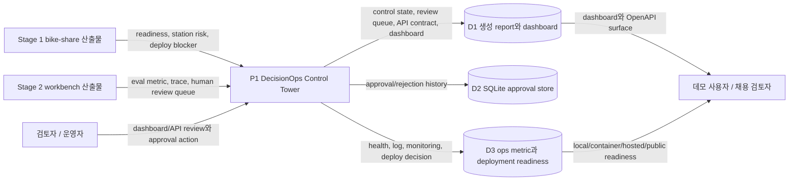
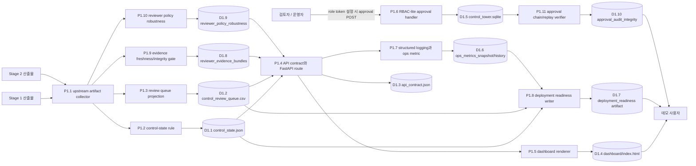

# 데이터 흐름도(DFD)

최종 업데이트: 2026-07-02 KST

## 범위

이 문서는 `decisionops-control-tower`의 현재 데이터 흐름을 설명한다. 범위는 Stage 1/2 산출물을 FastAPI, dashboard, freshness-gated evidence bundle, RBAC-lite approval write, SQLite persistence, monitoring snapshot, deployment readiness decision을 가진 local product-quality control surface로 바꾸는 과정이다.

핵심 안전 속성은 Control Tower가 reviewer decision을 local에 저장할 수는 있지만, upstream ML/agent artifact를 변경하거나 현실 action을 dispatch하지 않는다는 점이다.

## 0단계 컨텍스트

## 1단계 논리 흐름

## 데이터 저장소

| 저장소 | 내용 | 생산자 | 소비자 |
|---|---|---|---|
| D1.1 `control_state.json` | Stage readiness, blocker, metric, deploy decision, artifact pointer | control-state rule | API, dashboard, deployment readiness |
| D1.2 `control_review_queue.csv` | Stage 2 queue와 control rule에서 projection된 review-required item | review queue projection | API, dashboard, approval handler |
| D1.3 `api_contract.json` | endpoint surface, auth/write policy, expected artifact | API contract writer | 검토자, OpenAPI/API smoke check |
| D1.4 `dashboard/index.html` | local reviewer dashboard | dashboard renderer | 검토자/데모 사용자 |
| D1.5 `control_tower.sqlite` | approval/rejection history와 audit record | RBAC-lite approval handler | API history endpoint, dashboard |
| D1.6 ops metric snapshot/history | queue status, freshness, health, API/runtime metric | monitoring writer | deployment readiness, dashboard/API |
| D1.7 deployment readiness artifact | local/container/hosted/public decision과 blocker | deployment readiness writer | 검토자, portfolio runbook |
| D1.8 reviewer evidence bundles | impact/action join, source age, SLA, SHA-256 fingerprint | evidence gate | API, dashboard, deployment readiness |
| D1.9 reviewer policy robustness | 4 stress scenarios, 3 capacities, 3 policies의 regret/stability | robustness evaluator | API, dashboard, final report |
| D1.10 approval audit integrity | chained decision hash, replay verdict, mismatch 위치 | approval verifier | API, dashboard, deployment readiness |

## 흐름 목록

| 흐름 | 출발 | 도착 | 데이터 | 검증 또는 gate |
|---|---|---|---|---|
| F1 | Stage 1 산출물 | artifact collector | bike readiness, station risk, public deploy blocker | 누락되거나 오래된 artifact는 blocker가 됨 |
| F2 | Stage 2 산출물 | artifact collector | eval metric, trace, human review queue | human action 전까지 review queue는 pending 유지 |
| F3 | artifact collector | control-state rule | 정규화된 upstream fact | rule은 `NO_GO`를 숨기지 않고 노출 |
| F4 | control-state rule | report/dashboard/API | control state와 blocker list | `scripts/run_all.sh`와 smoke check로 산출물 존재 검증 |
| F5 | review queue projection | API/dashboard | pending reviewer action | reviewer/admin 승인 전까지 queue는 advisory |
| F6 | 검토자/운영자 | approval handler | approve/reject decision | token 설정 시 write auth는 `reviewer` 또는 `admin` role 필요 |
| F7 | approval handler | SQLite store | local audit history | upstream mutation 또는 external dispatch 없음 |
| F8 | API/runtime | ops metric | health, queue, freshness, request log | monitoring snapshot/history는 generated artifact |
| F9 | control state/ops metric | deployment readiness writer | local/container/hosted/public readiness | public read-only와 hosted write gate를 분리 |
| F10 | impact/action artifact | evidence gate | source age, freshness, fingerprint, claim boundary | non-fresh evidence는 `needs_more_evidence`로 차단 |
| F11 | impact cards | robustness evaluator | capacity, unit jitter, confidence stress, source dropout | safety-first dominance와 zero public-claim violation 검증 |
| F12 | SQLite approval history | audit verifier | canonical decision payload와 replay state | chain/replay 실패 시 local deployment도 `NO_GO` |

## 신뢰/안전 경계

| 경계 | 규칙 |
|---|---|
| upstream artifact 경계 | Control Tower는 Stage 1/2 산출물을 읽기만 하고 수정하지 않는다. |
| write 경계 | Approval POST는 local `control_tower.sqlite`에만 기록한다. |
| auth 경계 | `CONTROL_TOWER_ROLE_TOKENS`가 설정되면 write action은 `X-Control-Tower-Token` 기반 reviewer/admin role이 필요하다. |
| observability 경계 | request log, ops metric, deployment readiness는 숨은 runtime state가 아니라 명시적 artifact다. |
| audit 경계 | Hash chain/replay는 local tamper evidence이며 외부 서명·공증을 주장하지 않는다. |
| public deploy 경계 | allowlist aggregate의 public read-only snapshot은 `GO`; hosted write는 credential/target hardening 전 `NO_GO`다. |

## 현재 운영 상태

- Local/container smoke check가 가능하다.
- Dashboard와 OpenAPI는 reviewer-facing product surface다.
- Public read-only snapshot은 validation/freshness 통과 상태이며, production identity/hosting hardening 전까지 hosted write만 차단된다.
