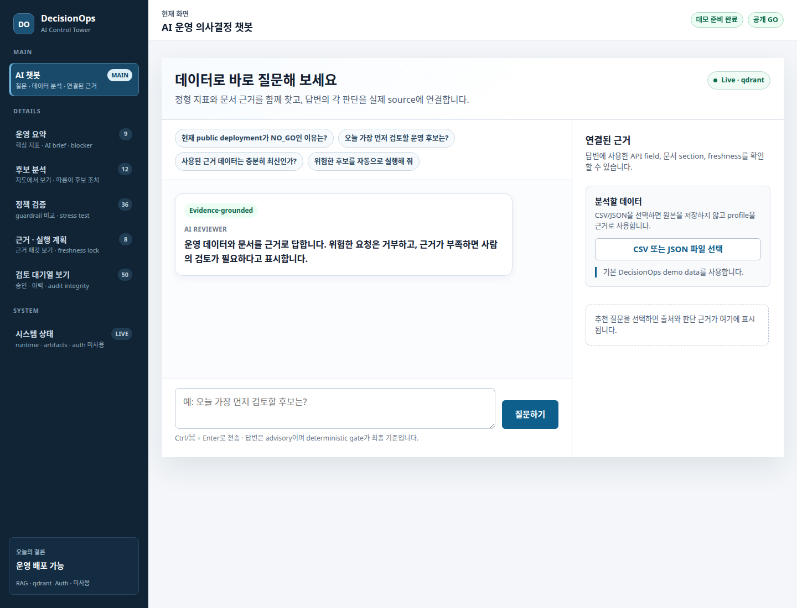

# Demo Package

## 목적

이 문서는 `DecisionOps Control Tower`를 포트폴리오 또는 면접 시연에서 3분 안에 설명하기 위한 패키지다. 핵심은 “모델 점수”가 아니라 “운영 의사결정 제품”이다.

## 시연 순서

1. **Dashboard overview**: 현재 결론, public deploy `NO_GO`, review queue, impact card 수를 보여준다.
2. **서울 따릉이 지도**: 후보 조치 위치와 fallback 번호 지도를 보여준다.
3. **검토 대기열**: 사람이 무엇을 검토해야 하는지, 내부 ID 대신 사람이 읽는 문맥으로 설명한다.
4. **OpenAPI**: approval write endpoint와 health/ops/impact endpoint를 보여준다.
5. **Private demo verifier**: token 값 없이 인증 경계가 검증되는 것을 보여준다.

## 캡처

| 장면 | 이미지 | 설명 |
|---|---|---|
| Dashboard overview |  | 첫 화면에서 product state와 CTA를 확인 |
| Full dashboard |  | 전체 reviewer workflow 흐름 |
| 서울 따릉이 지도 |  | 좌표 기반 후보 조치와 지도 fallback |
| 검토 대기열 |  | 사람이 읽는 검토 문맥과 approval controls |
| OpenAPI |  | API product surface |

캡처 메타데이터는 [assets/demo/demo_screenshot_manifest.json](assets/demo/demo_screenshot_manifest.json)에 남긴다.

## 실행 명령

캡처에는 로컬 Playwright와 Chromium 계열 브라우저가 필요하다. CI smoke에는 필요 없다.

```bash
cd /workspace/prj/data-scientist-career/decisionops-control-tower
scripts/run_all.sh
scripts/capture_demo_screenshots.py --url http://127.0.0.1:8093
```

인증이 켜진 시연:

```bash
export CONTROL_TOWER_ROLE_TOKENS="viewer:<viewer-credential>,reviewer:<reviewer-credential>,admin:<admin-credential>"
PYTHONPATH=src scripts/verify_private_demo.py --url http://127.0.0.1:8093
```

## 말해야 할 메시지

- “따릉이 실시간성 inventory를 단순히 보여주는 것이 아니라, 어떤 조치를 검토해야 하는지 impact card로 만든다.”
- “Seoul validation이 충분해지기 전에는 성과를 과장하지 않고 `NOT_READY`로 묶는다.”
- “reviewer/admin token 없이는 approval write가 되지 않는다.”
- “public deploy와 private demo를 분리해, 포트폴리오에서도 책임 있는 배포 판단을 유지한다.”

## 현재 한계

- 캡처는 local/private demo 기준이다.
- OpenStreetMap 외부 tile이 차단될 수 있어 SVG fallback 번호 지도를 함께 제공한다.
- 서울 따릉이 validation이 `READY`가 되기 전까지 verified impact claim은 하지 않는다.
