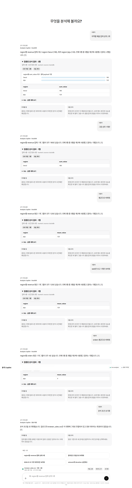
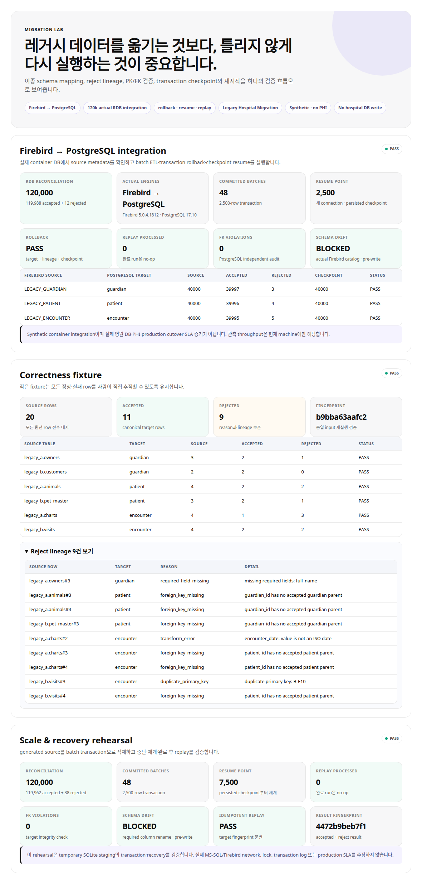
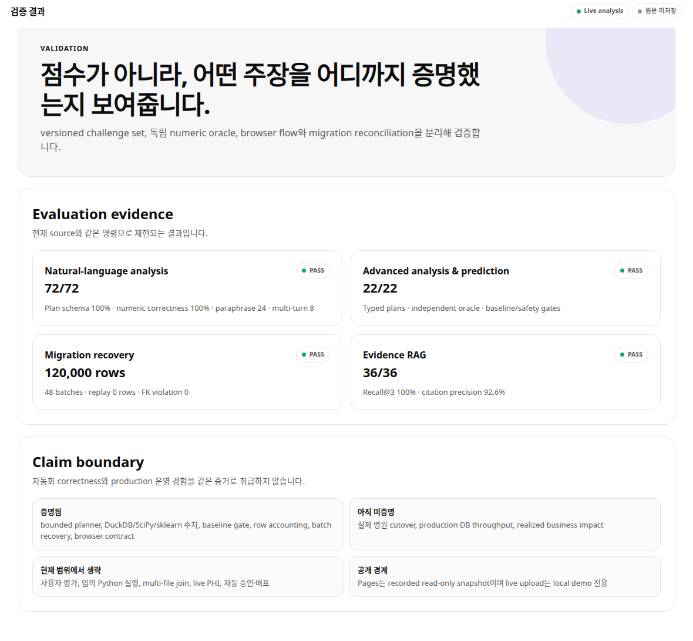
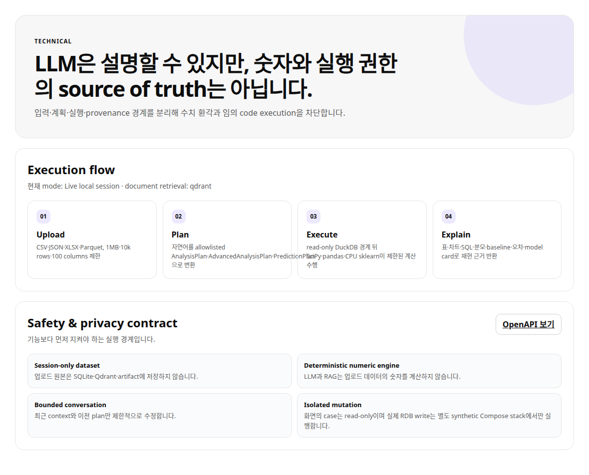
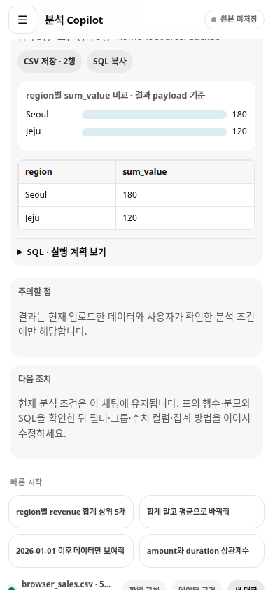

# Demo Package

## 목적

이 문서는 `Legacy Data Migration & Analysis Copilot`을 포트폴리오 또는 면접 시연에서 설명하기 위한 패키지다. 기본 화면은 분석 Copilot, Migration Lab, 검증 결과, 기술 상세의 4개 영역으로 끝나는 단일 제품이며, 설명 순서는 migration-first다.

## 시연 순서

1. **Actual RDB integration**: report에서 Firebird 5.0.4 → PostgreSQL 17.10과 `120,000 = 119,988 + 12`를 먼저 보여준다.
2. **Failure/recovery**: 2,500-row checkpoint, mid-batch rollback, 새 connection resume, completed replay 0행을 설명한다.
3. **Reconciliation/drift**: table별 source=accepted+rejected=checkpoint, FK 0건, actual catalog drift pre-write block을 확인한다.
4. **Readable correctness fixture**: UI의 Migration Lab에서 20 source = 11 accepted + 9 rejected와 reject lineage를 펼친다.
5. **Upload analysis**: CSV를 올리고 집계 질문 → `AnalysisPlan` → 표/차트/SQL을 보여준다.
6. **Natural multi-turn**: Top-N, sum→mean, categorical filter를 후속 질문으로 수정한다.
7. **Technical boundary**: synthetic/local과 production 경험의 경계, session-only upload, no arbitrary code를 설명한다.

현재 배포된 Pages는 2026-07-20 legacy snapshot이다. 최신 시연은 local/Compose에서 수행하며 Pages는 live upload가 아닌 recorded read-only surface임을 설명한다.

## 캡처

| 장면 | 이미지 | 설명 |
|---|---|---|
| Copilot overview |  | 업로드와 질문이 첫 행동인 단일 제품 화면 |
| Dataset analysis |  | plan·표·차트·SQL provenance와 후속 수정 |
| Migration Lab |  | correctness fixture, reject lineage, 120k recovery |
| Validation |  | automated correctness·recovery evidence |
| Technical boundary |  | 실행 흐름과 privacy/no-mutation 계약 |
| Mobile analysis |  | 390px에서 upload와 분석 결과 확인 |
| OpenAPI |  | API product surface |

캡처 메타데이터는 [assets/demo/demo_screenshot_manifest.json](assets/demo/demo_screenshot_manifest.json)에 남긴다.

## 실행 명령

캡처에는 로컬 Playwright와 Chromium 계열 브라우저가 필요하다. CI smoke에는 필요 없다.

```bash
cd /workspace/prj/personal/data-scientist-career/decisionops-control-tower
scripts/run_all.sh
scripts/verify_rdb_migration.sh
scripts/capture_demo_screenshots.py --url http://127.0.0.1:8093
```

인증이 켜진 시연:

```bash
export CONTROL_TOWER_ROLE_TOKENS="viewer:<viewer-credential>,reviewer:<reviewer-credential>,admin:<admin-credential>"
PYTHONPATH=src scripts/verify_private_demo.py --url http://127.0.0.1:8093
```

## 말해야 할 메시지

- “자연어를 바로 SQL로 실행하지 않고 typed `AnalysisPlan`으로 제한한 뒤 DuckDB가 숫자를 계산한다.”
- “표·차트만 보여주지 않고 input row, denominator, SQL과 fingerprint를 함께 반환한다.”
- “migration은 성공 row만 전시하지 않고 모든 source row를 accepted/rejected로 reconcile하고 원인을 추적한다.”
- “실제 Firebird와 PostgreSQL container 사이에서 120k를 처리했고, SQLite rehearsal은 작은 unit/recovery foundation으로 분리했다.”
- “2,500행 commit 뒤 다음 batch 중간 실패가 target과 checkpoint를 함께 rollback했고, 새 connection이 persisted checkpoint부터 재개했다.”
- “120k runtime은 현재 machine 관측값이며 실제 병원 cutover나 production SLA 주장이 아니다.”
- “업로드 원본은 session-only이며 숫자 계산에는 LLM이나 RAG를 쓰지 않는다.”

## 현재 한계

- 캡처는 local/private demo 기준이다.
- Public Pages에서는 파일 업로드와 free-form API가 비활성화된다.
- 실제 Firebird container adapter는 구현했지만 실제 병원 DB·PHI·production cutover·throughput SLA는 검증 범위가 아니다.
- 기존 approval/control API는 호환성을 위해 남아 있지만 단일 Copilot 기본 화면의 제품 흐름은 아니다.
