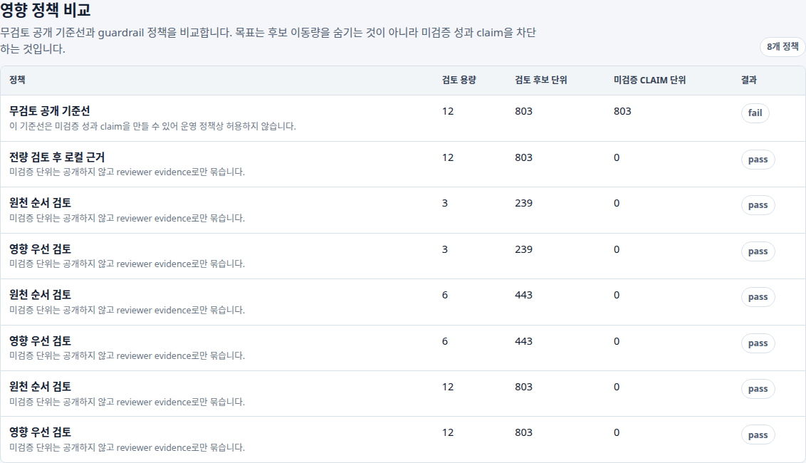
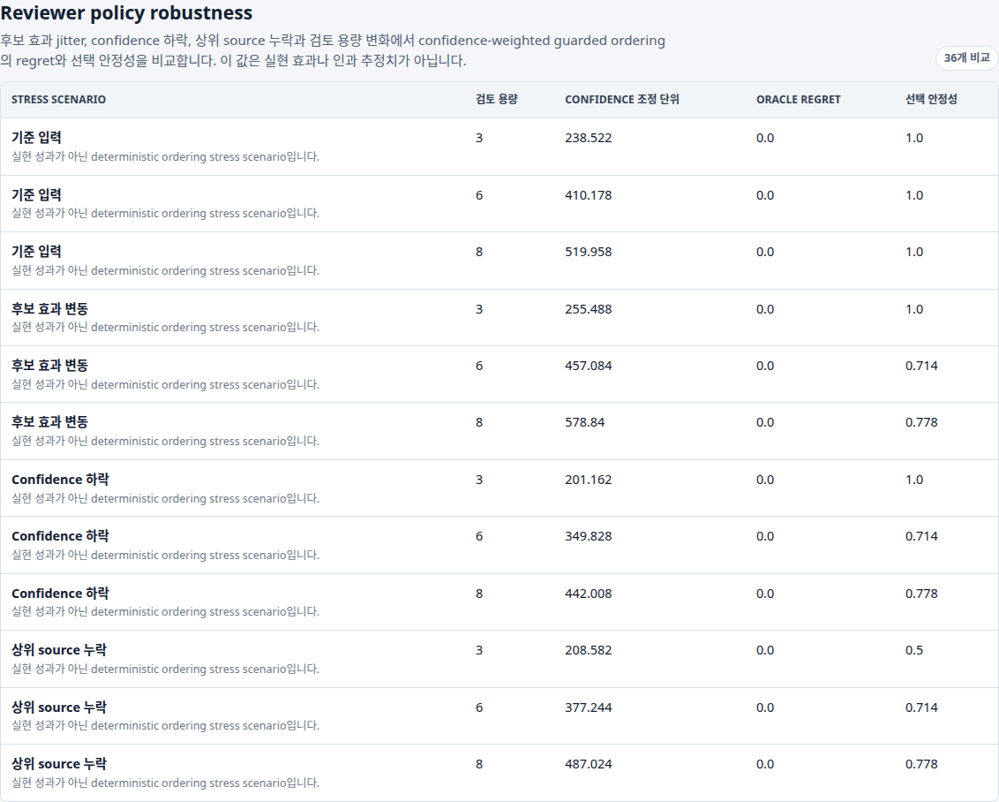
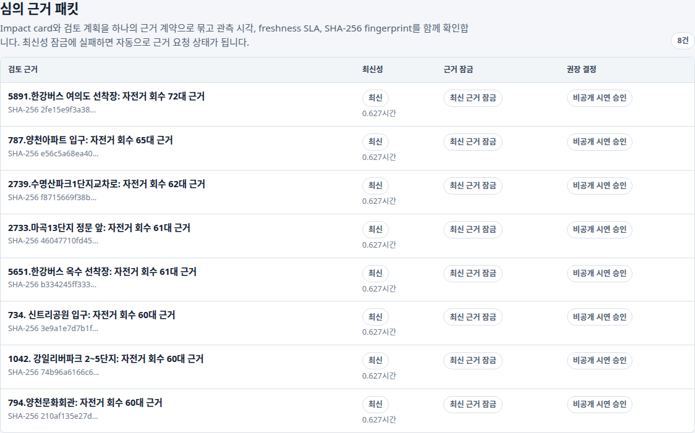
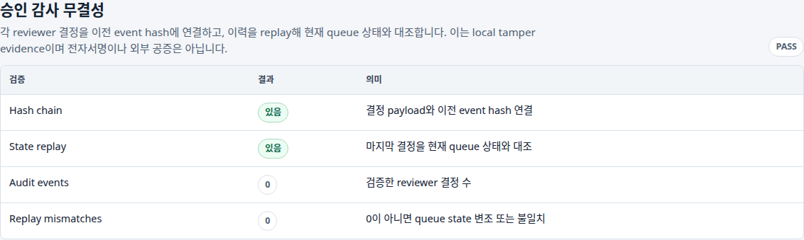

# Demo Package

## 목적

이 문서는 `DecisionOps Control Tower`를 포트폴리오 또는 면접 시연에서 3분 안에 설명하기 위한 패키지다. 핵심은 “모델 점수”가 아니라 “운영 의사결정 제품”이다.

## 시연 순서

1. **Dashboard overview**: 챗봇 기본 화면과 `Public read-only GO`를 보여주고, hosted write API는 별도 `NO_GO` gate임을 설명한다.
2. **AI Reviewer Brief**: agent가 API/artifact를 읽고 claim risk와 다음 검토 action을 요약하되, deterministic gate를 source of truth로 둔다는 점을 보여준다.
3. **서울 따릉이 지도**: 실제 OpenStreetMap tile 위에 후보 번호가 겹쳐 표시되는 것을 보여준다.
4. **영향 정책 비교**: unsafe publish 기준선과 guarded policy의 미검증 claim 차단 차이를 보여준다.
5. **Policy robustness**: 효과 jitter, confidence stress, source dropout에서 safety dominance, regret, selection stability를 보여준다.
6. **검토 실행 계획**: 검토 시간이 제한될 때 먼저 볼 local-only 후보를 보여준다.
7. **심의 근거 패킷**: source age, 3시간 SLA, SHA-256 lock을 확인한다.
8. **검토 대기열**: 사람이 무엇을 검토해야 하는지, 내부 ID 대신 사람이 읽는 문맥으로 설명한다.
9. **승인 감사 무결성**: chained hash와 queue-state replay가 함께 `PASS`인지 확인한다.
10. **OpenAPI**: approval write endpoint와 health/ops/impact/agent endpoint를 보여준다.
11. **Private demo verifier**: token 값 없이 인증 경계가 검증되는 것을 보여준다.

## 캡처

| 장면 | 이미지 | 설명 |
|---|---|---|
| Dashboard overview |  | 첫 화면에서 product state와 CTA를 확인 |
| Sidebar dashboard |  | 챗봇과 세부 reviewer workflow를 분리한 화면 |
| 서울 따릉이 지도 |  | 좌표 기반 후보 조치를 실제 지도 tile 위에 번호로 표시 |
| 정책 비교 |  | 미검증 claim 차단과 capacity 비교 |
| Policy robustness |  | deterministic stress scenario의 safety dominance와 regret |
| 심의 근거 패킷 |  | source age, freshness SLA, SHA-256 lock 확인 |
| 검토 대기열 |  | 사람이 읽는 검토 문맥과 approval controls |
| 승인 감사 무결성 |  | decision hash chain과 queue-state replay verdict |
| OpenAPI |  | API product surface |

캡처 메타데이터는 [assets/demo/demo_screenshot_manifest.json](assets/demo/demo_screenshot_manifest.json)에 남긴다.

## 실행 명령

캡처에는 로컬 Playwright와 Chromium 계열 브라우저가 필요하다. CI smoke에는 필요 없다.

```bash
cd /workspace/prj/personal/data-scientist-career/decisionops-control-tower
scripts/run_all.sh
scripts/capture_demo_screenshots.py --url http://127.0.0.1:8093
```

인증이 켜진 시연:

```bash
export CONTROL_TOWER_ROLE_TOKENS="viewer:<viewer-credential>,reviewer:<reviewer-credential>,admin:<admin-credential>"
PYTHONPATH=src scripts/verify_private_demo.py --url http://127.0.0.1:8093
```

## 말해야 할 메시지

- “따릉이 실시간성 inventory를 단순히 보여주는 것이 아니라, 어떤 조치를 검토해야 하는지 impact card로 만든다.”
- “AI agent는 decision maker가 아니라 health/API/artifact를 읽는 evidence-grounded reviewer assistant다.”
- “2026-07-20 12:25 KST snapshot은 Seoul validation `READY`, evidence 8/8 fresh로 public read-only gate를 통과했다.”
- “unsafe publish 기준선은 미검증 claim을 만들 수 있지만 guarded policy는 같은 후보를 local evidence로만 보존한다.”
- “reviewer/admin token 없이는 approval write가 되지 않는다.”
- “3시간 SLA를 넘기거나 timestamp가 잘못된 근거는 다시 생성하기 전까지 승인 후보가 아니다.”
- “Robustness audit은 실현 효과가 아니라 ordering stress test이며, invalid evidence를 먼저 줄이고 동률에서 confidence-adjusted units를 비교한다.”
- “승인 이력은 이전 event hash와 연결하고 replay 결과를 현재 queue와 대조해 silent mutation을 탐지한다.”
- “public deploy와 private demo를 분리해, 포트폴리오에서도 책임 있는 배포 판단을 유지한다.”

## 현재 한계

- 캡처는 local/private demo 기준이다.
- OpenStreetMap tile 네트워크가 차단되면 지도 배경 로딩이 제한될 수 있지만 후보 번호와 evidence table은 유지된다.
- Public read-only `GO`는 aggregate와 근거의 공개 가능 상태이며, 실제 재배치 성과나 hosted write 승인을 뜻하지 않는다.
- Approval hash chain은 local tamper evidence이며 서명된 외부 attestation은 아니다.
