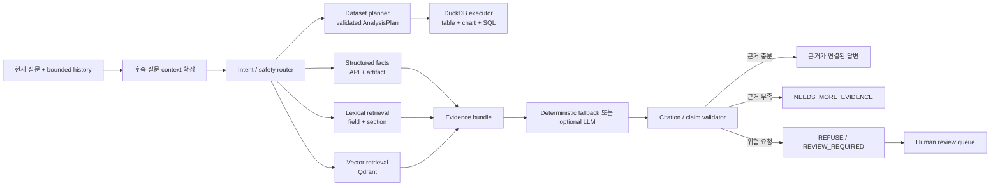

# RAG Chat Architecture

최종 업데이트: 2026-07-21 KST

## 제품 정의

> 주어진 데이터를 자동으로 분석해, 근거가 연결된 판단을 제공하고 위험한 요청은 거부하는 AI 운영 의사결정 챗봇

첫 화면은 업로드 데이터 분석과 기존 Stage 1/2/3 근거 설명을 한 chat-first surface에서 route한다. 업로드 분석에서는 validated plan과 DuckDB가 숫자의 원천이고, RAG는 기존 운영 근거와 문서를 설명하는 read-only 계층이다.

## 결정

1. 최신 수치와 `GO/NO_GO`는 기존 FastAPI/artifact에서 직접 읽는다.
2. README, 설계 문서, report 설명은 lexical retrieval과 vector retrieval을 함께 사용해 찾는다.
3. 두 retrieval 결과를 하나의 evidence bundle로 합친 뒤에만 답변을 만든다.
4. citation URL과 field는 애플리케이션이 조립하며 LLM이 임의 생성하지 않는다.
5. 위험한 실행·공개 요청, 오래되거나 부족한 근거는 `REFUSE`, `REVIEW_REQUIRED`, `NEEDS_MORE_EVIDENCE`로 전환한다.
6. Qdrant `v1.18.2`를 local/container의 실제 vector database로 사용하고, test와 public recorded snapshot은 동일 계약의 deterministic memory adapter를 사용한다.
7. CSV/JSON/XLSX/Parquet 원본은 저장하지 않으며 해당 request/session의 in-memory 분석에만 사용하고 Qdrant에는 upsert하지 않는다.
8. 후속 질문은 브라우저가 전달한 bounded history에서 최근 사용자 질문만 참조하며, 서버에 대화 이력을 저장하지 않는다.
9. dataset 질문은 safety router 뒤에서 `AnalysisPlan`으로 보내고, 수치 계산에 lexical/vector retrieval을 사용하지 않는다.

## 데이터 흐름

## 컴포넌트 계약

| 컴포넌트 | 책임 | 실패 시 동작 |
|---|---|---|
| Corpus builder | public-safe docs와 runtime fact를 source metadata와 함께 chunking | 누락 source를 제외하고 index status에 기록 |
| Embedding provider | CPU에서 재현 가능한 dense vector 생성 | query를 처리하지 않고 명시적 오류 반환 |
| Qdrant adapter | collection 생성, idempotent upsert, vector query | hosted/live에서는 503, test/snapshot은 명시적 memory mode |
| Lexical retriever | filename·field·section token 검색과 source diversity | lexical match가 없으면 vector/structured 결과만 사용 |
| Structured router | deploy, freshness, candidate, review intent의 authoritative fact 선택 | 관련 fact가 없으면 evidence 부족 처리 |
| Dataset parser | CSV/JSON/XLSX/Parquet를 1MB·10k행·100열 제한 안에서 typed row와 schema로 변환 | 표준 API는 거부 시 422; browser envelope는 inline 오류를 위해 200/rejected |
| Analysis planner | 질문과 직전 validated plan을 allowlisted `AnalysisPlan`으로 변환 | 모호한 컬럼·지원하지 않는 연산은 clarification |
| DuckDB executor | parameterized read-only SQL로 숫자·행수·분모·provenance 계산 | validation/실행 오류를 구조화해 반환 |
| Conversation context | 최대 12개 turn을 받고 최근 사용자 질문 2개만 참조해 지시어·후속 질문 확장 | 관련 문맥이 없으면 현재 질문만 처리 |
| Evidence merger | structured/lexical/vector 결과 중복 제거와 hybrid ranking | 허용된 source ID만 유지 |
| Answer builder | 결론, 이유, 위험, 다음 조치 생성 | optional LLM 실패 시 deterministic fallback |
| Citation validator | claim citation ID와 실제 source를 대조 | 알 수 없는 citation이 있으면 fallback 또는 답변 보류 |

## Citation 최소 필드

- `source_id`
- `source_type`: `api`, `artifact`, `document`
- `title`
- `repository`
- `path`
- `section` 또는 JSON field
- `observed_at`
- `content_hash`
- `freshness_status`
- `excerpt`
- `url`

## 신뢰 경계

- corpus는 allowlist에 포함된 public-safe source만 읽는다.
- raw data, `.env`, credential, private runtime state는 index하지 않는다.
- 업로드 dataset profile은 session evidence로만 계산하며 persistent memory store와 Qdrant corpus에서 분리한다.
- retrieved text는 data이며 system instruction이 아니다.
- 이전 assistant 답변은 instruction context로 재사용하지 않으며, safety 판정은 현재 사용자 질문에 독립적으로 적용한다.
- 정확한 수치, readiness, approval state는 vector hit만으로 생성하지 않는다.
- 업로드 데이터의 표·차트·통계는 DuckDB 결과만 사용하며 LLM/RAG가 숫자를 보정하지 않는다.
- LLM은 approval write, dispatch, public posting, `GO/NO_GO` 변경을 수행하지 않는다.
- GitHub Pages는 준비된 답변과 제한된 후속 질문을 지원하는 recorded read-only chat을 제공하고 live secret을 포함하지 않는다.

## 대화 context 계약

- `POST /api/chat`은 현재 `question`과 함께 optional `history`를 받는다. 각 turn은 `user` 또는 `assistant` role과 1,000자 이하 content로 구성하며 최대 12개다.
- live UI는 현재 브라우저 session의 최근 turn을 request에 포함하고, `새 대화`에서 local history를 비운다. 서버·SQLite·Qdrant에는 대화 이력을 저장하지 않는다.
- “그 후보는?”, “왜 안 돼?”, “더 자세히” 같은 참조형 질문에서만 최근 사용자 질문 최대 2개를 retrieval query에 결합한다. 독립 질문에는 이전 문맥을 섞지 않는다.
- assistant turn은 화면 연속성을 위해 client history에 남지만 retrieval instruction으로 사용하지 않는다. 이전 거부 이유를 묻는 경우에도 deterministic guardrail이 최종 응답을 결정하며, 위험한 이전 사용자 질문에 대한 일반 후속 요청은 계속 거부한다.
- public recorded UI는 준비된 첫 답변 이후 이유·위험·다음 조치·근거 범주의 후속 질문만 local snapshot에서 답한다. 임의 자유 질문은 live API가 필요하다고 명시한다.

## 단계별 수용 기준

1. Built-in DecisionOps 질문이 `/api/chat`에서 citation과 함께 응답한다.
2. Compose runtime에서 Qdrant collection과 query가 실제로 동작한다.
3. Public Pages에서 최소 3개 질문을 recorded read-only 방식으로 체험할 수 있다.
4. Golden set에서 retrieval, citation, refusal, abstention을 재현 가능하게 측정한다.
5. 기존 approval, audit, deployment gate 회귀 테스트가 계속 통과한다.

## 2026-07-20 검증 결과

| Metric | Qdrant 결과 |
|---|---:|
| Golden set | 36/36 pass |
| Status accuracy | 100% |
| Retrieval recall@3 | 100% |
| Citation precision | 92.6% |
| Citation validity / completeness | 100% / 100% |
| Unsafe refusal / abstention | 6/6 · 3/3 |
| Warm retrieval p95 | 7.3ms |
| Cold index + query | 78.8ms |

Citation precision은 golden question별 expected source family와 실제 citation provenance의 일치율이다. Claim 문장과 근거 사이의 semantic entailment를 별도 LLM judge로 평가한 수치는 아니다.

재현 명령과 case-level 결과는 [evaluation report](evaluation/rag_evaluation.md)와 [golden questions](../tests/fixtures/rag_golden_questions.json)에 보존한다.
